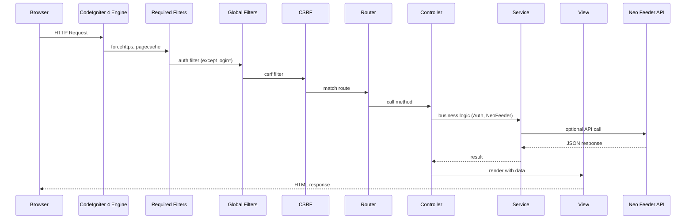
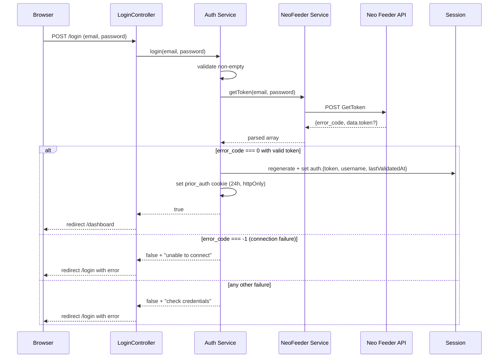
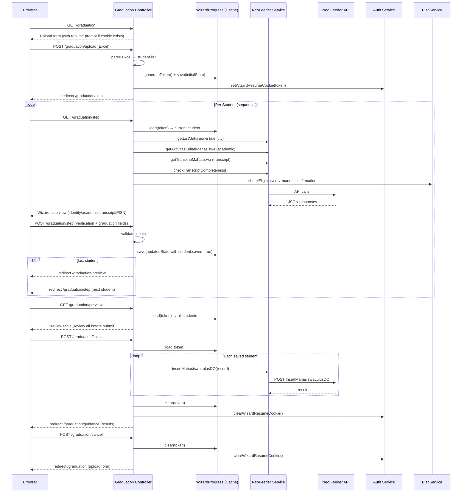

# BASE Architecture

## System Overview

BASE is a CodeIgniter 4 web application that serves as a Web Service Client for Neo Feeder (PDDIKTI). Authentication is session-based using Neo Feeder as the external identity provider — no local user database is used. The UI uses AdminLTE 4 (Bootstrap 5) with vanilla JavaScript.

> **Related documents:** See `CONTRIBUTING.md` for coding conventions and the decision framework.

---

## Tech Stack

| Layer | Technology | Version | Role |
|-------|-----------|---------|------|
| Framework | CodeIgniter 4 | ^4.7 | MVC, routing, filters, HTTP client |
| Identity Provider | Neo Feeder WS API | — | Authentication & token validation |
| UI Template | AdminLTE 4 | ^4.0 | Dashboard layout, sidebar, navbar |
| CSS Framework | Bootstrap 5 | 5.3.x | Components, grid, utilities (transitive via AdminLTE 4) |
| Icons | Font Awesome 7 | ^7.3 | UI icons |
| JS Runtime | Vanilla JavaScript | — | AdminLTE 4 native, no jQuery |
| Session | CI4 FileHandler | — | Auth state storage |
| HTTP Client | CI4 CURLRequest | — | Neo Feeder API communication |
| Encryption | CI4 Encryption Service | — | Prior-auth cookie signing |

---

## Request Lifecycle



Filter ordering: **Required before** → **Global before** → Route → Controller → View → **Global after** → **Required after**

- **Required filters** (`$routes->setFilter()`) run on every request regardless of route, wrapped outside global filters.
- **Global filters** (defined in `Config\Filters::$globals`) run on all routes except those explicitly excluded.
- **Route filters** (defined per-route in `$routes->get()` options) run only on specific routes.

---

## Routes

| Method | URI | Handler | Auth Filter | CSRF |
|--------|-----|---------|-------------|------|
| GET | `/` | `Home::index` | Protected | — |
| GET | `/login` | `Login::index` | Whitelisted | — |
| POST | `/login` | `Login::attemptLogin` | Whitelisted | Enabled |
| POST | `/logout` | `Login::logout` | Protected | Enabled |
| GET | `/dashboard` | `Dashboard::index` | Protected | — |
| GET | `/profil-pt` | `ProfilPT::index` | Protected | — |
| GET | `/mahasiswa` | `Mahasiswa::index` | Protected | — |
| GET | `/mahasiswa/edit/(:any)` | `Mahasiswa::edit/$1` | Protected | — |
| GET | `/mahasiswa/detail/(:any)` | `Mahasiswa::detail/$1` | Protected | — |
| POST | `/mahasiswa/edit/(:any)` | `Mahasiswa::editPost/$1` | Protected | Enabled |
| POST | `/mahasiswa/delete/(:any)` | `Mahasiswa::delete/$1` | Protected | Enabled |
| GET | `/aktivitas-kuliah` | `AktivitasKuliah::index` | Protected | — |
| GET | `/aktivitas-kuliah/edit/(:any)/(:any)` | `AktivitasKuliah::edit/$1/$2` | Protected | — |
| POST | `/aktivitas-kuliah/edit/(:any)/(:any)` | `AktivitasKuliah::editPost/$1/$2` | Protected | Enabled |
| POST | `/aktivitas-kuliah/delete/(:any)/(:any)` | `AktivitasKuliah::delete/$1/$2` | Protected | Enabled |
| GET | `/mahasiswa-lulus-do` | `MahasiswaLulusDo::index` | Protected | — |
| GET | `/graduation` | `Graduation::index` | Protected | — |
| POST | `/graduation/upload` | `Graduation::upload` | Protected | Enabled |
| GET | `/graduation/resume` | `Graduation::resume` | Protected | — |
| GET | `/graduation/step` | `Graduation::step` | Protected | — |
| POST | `/graduation/step` | `Graduation::stepPost` | Protected | Enabled |
| GET | `/graduation/preview` | `Graduation::preview` | Protected | — |
| POST | `/graduation/finish` | `Graduation::finish` | Protected | Enabled |
| GET | `/graduation/guidance` | `Graduation::guidance` | Protected | — |
| GET | `/graduation/template` | `Graduation::downloadTemplate` | Protected | — |
| POST | `/graduation/cancel` | `Graduation::cancel` | Protected | Enabled |

---

## Key Classes & Dependencies

| Class | File | Responsibility | Dependencies |
|-------|------|---------------|--------------|
| `BaseController` | `Controllers/BaseController.php` | Shared controller setup (session, helpers) | — |
| `Home` | `Controllers/Home.php` | Root redirect: `/login` (anonymous) or `/dashboard` (authenticated) | `Auth` service |
| `Login` | `Controllers/Login.php` | Login form, login attempt, logout | `Auth` service |
| `Dashboard` | `Controllers/Dashboard.php` | Protected landing page | `Auth` service, 4 views |
| `ProfilPT` | `Controllers/ProfilPT.php` | PT profile page: formats `GetProfilPT` data (SK date to Indonesian, website URL normalization) | `Auth`, `NeoFeeder` services, view `profil_pt/index` |
| `Mahasiswa` | `Controllers/Mahasiswa.php` | CRUD for student biodata: list, detail (read-only), edit, update, delete | `Auth`, `NeoFeeder` services, views `mahasiswa/` |
| `AktivitasKuliah` | `Controllers/AktivitasKuliah.php` | CRUD for course activities: list, edit, update, delete | `Auth`, `NeoFeeder` services, views `aktivitas_kuliah/` |
| `MahasiswaLulusDo` | `Controllers/MahasiswaLulusDo.php` | Read-only list of graduated/dropped-out students | `Auth`, `NeoFeeder` services, view `mahasiswa_lulus_do/index` |
| `Graduation` | `Controllers/Graduation.php` | PISN graduation wizard: Excel upload, sequential verification, pre-submit preview, template download, cancellation, transcript completeness check | `Auth`, `NeoFeeder`, `PisnService`, `WizardProgress` services, views `graduation/` |
| `AuthFilter` | `Filters/AuthFilter.php` | Route protection middleware | `Auth` service, CI4 Session |
| `Auth` | `Libraries/Auth.php` | Auth logic: login, logout, validate, caching, wizard resume cookie | `NeoFeeder`, `Session`, `EncrypterInterface` |
| `NeoFeeder` | `Libraries/NeoFeeder.php` | HTTP layer for Neo Feeder API: GetProfilPT, GetToken, GetListMahasiswa, GetAktivitasKuliahMahasiswa, GetListMahasiswaLulusDO, GetCountMahasiswa, GetCountAktivitasKuliahMahasiswa, GetCountMahasiswaLulusDO, GetTranskripMahasiswa, GetBiodataMahasiswa, GetDetailPerkuliahanMahasiswa, InsertMahasiswaLulusDO, Insert/Update/Delete BiodataMahasiswa, Insert/Update/Delete PerkuliahanMahasiswa | `NeoFeederConfig`, `CURLRequest` |
| `NeoFeeder` (Config) | `Config/NeoFeeder.php` | API base URL, timeouts, TTL | — |
| `PisnService` | `Libraries/PisnService.php` | PISN eligibility check (stubbed, awaiting LLDIKTI API) | — |
| `WizardProgress` | `Libraries/WizardProgress.php` | Cache-backed progress store for graduation wizard (survives auth expiry) | CI4 `CacheInterface` |

### Dependency Injection Chain

```
Services::auth()
  └─> Auth(NeoFeeder, Session, EncrypterInterface)

Services::neoFeeder()
  └─> NeoFeeder(NeoFeederConfig, CURLRequest)

Services::wizardProgress()
  └─> WizardProgress(Cache)

Services::pisn()
  └─> PisnService()
```

All registered as singletons in `app/Config/Services.php`.

---

## Authentication Flow



### Token Validation (Auth Filter → isLoggedIn → validateToken)

```
isLoggedIn():
  1. Check session auth.token exists → if null, return false
  2. Check auth.lastValidatedAt + TTL (300s) > now → if valid, return true
  3. Otherwise call validateToken()

validateToken():
  GET /dashboard → AuthFilter → Auth::isLoggedIn() → [cache miss] → NeoFeeder::getProfilPT()
  
  error_code=0    → update lastValidatedAt, allow access
  error_code=100  → clear auth session, redirect /login with "session expired"
  error_code=-1   → fallback to cached result if within TTL, else deny (keep session)
  error_code=-2   → clear auth session, redirect /login with "session expired"
  other errors    → deny access (keep session intact)
```

### Prior-Auth Cookie (Session Timeout Detection)

When CI4 session expires but the prior-auth cookie still exists, the Auth Filter detects this and shows "Your session has expired" instead of a silent redirect. This distinguishes "never logged in" from "session timed out."

### Wizard Resume Cookie (Graduation Wizard Survivability)

The graduation wizard persists progress in the CI4 cache (`WizardProgress`) keyed by an opaque token. That token is also stored in a `wizard_resume` cookie (24h, httpOnly, SameSite=Lax, no encryption — opaque random value). This allows the wizard to survive auth-session expiry: after re-login, the cookie is read, the cached progress is loaded, and the admin continues from the interrupted step. The cookie is cleared on wizard completion (`finish`) or explicit cancellation (`cancel`).

```
wizard_resume: <32-char-hex-token>
    ├── expires: +24 hours
    ├── httpOnly: true
    ├── sameSite: Lax
    └── secure: true (production)
```

---

## Data Model

### Session Schema

```
auth (namespace)
├── username: string        # User email from login form
├── token: string           # Neo Feeder API token
└── lastValidatedAt: int    # Unix timestamp of last GetProfilPT success
```

### Cookies

```
prior_auth: base64(encrypt(username | hmac(token)))
    ├── expires: +24 hours
    ├── httpOnly: true
    ├── sameSite: Lax
    └── secure: true (production)

wizard_resume: <32-char-hex-token>
    ├── expires: +24 hours
    ├── httpOnly: true
    ├── sameSite: Lax
    └── secure: true (production)
```

---

## Graduation Wizard Flow

The PISN graduation wizard guides an admin through sequential verification of each prospective graduate:



### Wizard Step Verification

Each step requires the admin to confirm four checks before advancing:

1. **Identity** — Student matches KTP (`identity_ok` checkbox)
2. **Academic** — Optional flag/notes (`academic_flag` text); if filled, `biaya_kuliah` required
3. **PISN Eligibility** — Manual confirmation (`pisn_ok` checkbox; API deferred)
4. **Graduation Fields** — NIM, name, jenis_keluar, tgl_keluar, periode_keluar, IPK, no_ijazah (default "-")

Validation fails fast with aggregated errors; the step re-renders with input preserved.

### Resumability

- **Cache store** (`WizardProgress`): progress keyed by token, TTL 24h (default)
- **Resume cookie** (`wizard_resume`): opaque token, survives CI4 session expiry
- **Resume entry point**: `GET /graduation/resume` loads token from cookie, validates cache, redirects to `/graduation/step`
- **Cancellation**: `POST /graduation/cancel` clears cache and cookie

### Transcript Completeness Check (ENH-020)

`Graduation::checkTranscriptCompleteness()` scans `GetTranskripMahasiswa` rows for a thesis/skripsi course (name matching `/skripsi|tugas\s*akhir|thesis|disertasi/i`) with a non-empty grade (`nilai_huruf` or `nilai_angka`). Returns `{complete: bool, reason: string}`. This is a heuristic — confirm naming against real data and tighten pattern if needed.

### PISN Eligibility (Stubbed)

`PisnService::checkEligibility()` currently returns `{available: false, eligible: null, reason: "PISN API not yet available..."}`. The wizard treats this as a manual confirmation step (`pisn_ok` checkbox). When LLDIKTI confirms the endpoint, plug the real adapter into `PisnService` without touching the wizard.

---

## Environment Variables

Key `.env` variables used by the application:

| Variable | Type | Used By | Purpose |
|----------|------|---------|---------|
| `app.baseURL` | string | CI4 Router | Base URL for `base_url()` helper |
| `encryption.key` | hex string | CI4 Encryption Service | Cookie encryption (32-byte hex) |
| `neofeeder.apiBaseUrl` | string | `Config/NeoFeeder.php` | Neo Feeder API base URL (required) |
| `neofeeder.connectionTimeout` | int | `Config/NeoFeeder.php` | Connection timeout (seconds) |
| `neofeeder.requestTimeout` | int | `Config/NeoFeeder.php` | HTTP request timeout (seconds) |
| `neofeeder.validationTTL` | int | `Config/NeoFeeder.php` | Token validation cache TTL (seconds) |

Set these in `.env` (copy from `env` template). Never commit `.env`.

---

## Asset Pipeline

```
npm install
  └─> node_modules/
        ├── admin-lte/dist/
        ├── bootstrap/dist/
        └── @fortawesome/fontawesome-free/

npm run build  (scripts/build-assets.js)
  └─> public/
        ├── adminlte/css/adminlte.min.css
        ├── adminlte/js/adminlte.min.js
        ├── bootstrap/css/bootstrap.min.css
        ├── bootstrap/js/bootstrap.bundle.min.js
        ├── fontawesome/css/all.min.css
        └── fontawesome/webfonts/*.woff2
```

All assets are pre-compiled (no bundler). The build script copies files from `node_modules/` to `public/`.

---

## Directory Structure (Key Directories)

```
app/
├── Config/          # NeoFeeder, Filters, Routes, Services
├── Controllers/     # Login, Dashboard, ProfilPT, Home, BaseController, Mahasiswa, AktivitasKuliah, MahasiswaLulusDo, Graduation
├── Filters/         # AuthFilter (route protection)
├── Libraries/       # Auth, NeoFeeder, PisnService, WizardProgress (service layer)
└── Views/           # login/ (standalone), layout/ (header,sidebar,footer), dashboard/, profil_pt/, mahasiswa/, aktivitas_kuliah/, mahasiswa_lulus_do/, graduation/
public/              # index.php + built assets
├── adminlte/        # adminlte.min.css, adminlte.min.js
├── bootstrap/       # bootstrap.min.css, bootstrap.bundle.min.js
└── fontawesome/     # all.min.css, webfonts/
```
