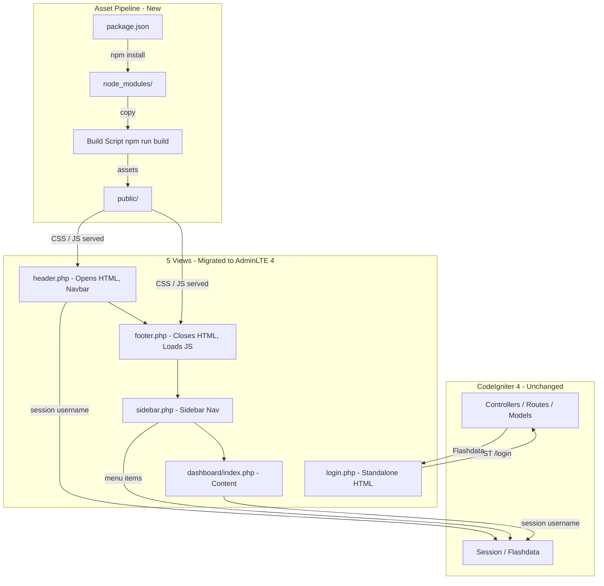

## Architecture Overview



### Key Decisions

1. **npm over Composer for AdminLTE 4** -- AdminLTE 4 is distributed as an npm package only (no Composer release). The existing Composer dep `almasaeed2010/adminlte` is removed; a new `package.json` holds the frontend stack.
2. **Copy-based asset bundling** -- A simple npm script (e.g. `cp` / `xcopy` or `cpx`) copies assets from `node_modules/` to `public/`. No webpack, vite, or bundler is introduced; AdminLTE 4 ships pre-compiled minified assets ready for static serving.
3. **Zero backend changes** -- Controllers, models, routes, session handling, and authentication all remain untouched. The views receive the same PHP variables (`$username`, `$menuItems`, `$flashMessage`, CSRF token) from the existing CI4 backend.
4. **jQuery removed entirely** -- AdminLTE 4 uses vanilla JavaScript natively. No jQuery or jQuery plugins (icheck, etc.) are loaded in any view.

## Component Design

### 1. Login Page View (`login.php`)
- **Responsibility**: Standalone full HTML document for unauthenticated users. Renders login form with CSRF token, email and password fields, "Remember Me" checkbox (Bootstrap 5 native), and flash error/message alerts.
- **Key changes from AdminLTE 3**: Replace AdminLTE 3 login box classes (`login-box`, `login-logo`, `login-card-body`) with AdminLTE 4 equivalents (`login-page`, `login-box`, `card`). Replace `data-dismiss` with `data-bs-dismiss`. Remove icheck-bootstrap CSS/JS. Remove jQuery script tags. Use Font Awesome 6 `fas` icons. Load CSS from local `public/` paths.
- **Dependencies**: Bootstrap 5 CSS (via AdminLTE 4), Font Awesome 6 CSS, AdminLTE 4 CSS.
- **Interfaces**: Receives PHP `$flashMessage` (string), `$flashType` (string: "error"|"message"), `$config` (for CSRF). POSTs to `/login`.

### 2. Layout Header View (`header.php`)
- **Responsibility**: Opens the HTML document (`<!DOCTYPE html>`, `<html>`, `<head>` with CSS link tags, `<body class="layout-fixed">`, `<div class="wrapper">`). Renders AdminLTE 4 navbar with pushmenu sidebar toggle button, application branding text, and logout button.
- **Key changes from AdminLTE 3**: Replace AdminLTE 3 `main-header` / `navbar` classes with AdminLTE 4 `navbar` structure. Use `data-bs-toggle` instead of `data-toggle`. Replace FA 5 CDN link with local FA 6 CSS. Remove jQuery CDN script. Add local bootstrap CSS and adminlte CSS links.
- **Dependencies**: Bootstrap 5 CSS (from `public/bootstrap/css/`), Font Awesome 6 CSS (from `public/fontawesome/css/`), AdminLTE 4 CSS (from `public/adminlte/css/`).
- **Interfaces**: Receives PHP `$username` (string) for display in logout area.

### 3. Layout Sidebar View (`sidebar.php`)
- **Responsibility**: Renders the AdminLTE 4 sidebar with user panel (username display), main navigation menu items (sidebar menu with treeview submenus), and opens the `content-wrapper` div.
- **Key changes from AdminLTE 3**: Replace AdminLTE 3 `main-sidebar` / `sidebar` classes with AdminLTE 4 `main-sidebar` / `sidebar` structure. Use Bootstrap 5 collapse data attributes (`data-bs-toggle="collapse"`) instead of jQuery-based treeview. Replace legacy `nav nav-pills nav-sidebar` classes with AdminLTE 4's `nav nav-pills nav-sidebar flex-column` (class names are similar but internal AdminLTE 4 CSS differs).
- **Dependencies**: AdminLTE 4 CSS (already loaded in header).
- **Interfaces**: Receives PHP `$menuItems` (array of menu item arrays with `label`, `icon`, `route`, `submenu`), `$currentRoute` (string) for active state highlighting.

### 4. Layout Footer View (`footer.php`)
- **Responsibility**: Closes the `content-wrapper` div, renders the AdminLTE 4 footer bar, closes the `wrapper` div, loads JavaScript assets (Bootstrap 5 bundle JS, AdminLTE 4 JS), closes `</body></html>`.
- **Key changes from AdminLTE 3**: Replace AdminLTE 3 footer classes (`main-footer`) with AdminLTE 4 footer. Replace CDN JS references with local copies from `public/`. Remove jQuery CDN script. Remove any icheck JS initialization. Add `adminlte.min.js` script tag (AdminLTE 4 JS initializes on DOMContentLoaded; it requires specific `data-*` attributes on navbar/sidebar elements in the header/sidebar views to function -- no manual JS init call needed).
- **Dependencies**: Bootstrap 5 JS bundle (`public/bootstrap/js/bootstrap.bundle.min.js`), AdminLTE 4 JS (`public/adminlte/js/adminlte.min.js`).
- **Interfaces**: No PHP variables. Renders static footer text.

### 5. Dashboard Index View (`dashboard/index.php`)
- **Responsibility**: Renders inside the `content-wrapper` div with a welcome card and any dashboard content. Uses Bootstrap 5 card components.
- **Key changes from AdminLTE 3**: Replace AdminLTE 3 content header and card classes with AdminLTE 4 equivalents. `content-header` / `content` divs remain similar. Cards use Bootstrap 5 markup (`card`, `card-header`, `card-body`).
- **Dependencies**: Bootstrap 5 CSS (loaded in header), AdminLTE 4 CSS (loaded in header).
- **Interfaces**: Receives PHP `$username` (string) for welcome message.

### 6. Asset Pipeline
- **Responsibility**: Manage frontend dependencies and copy built assets into the web-accessible `public/` directory.
- **Key changes from AdminLTE 3**: Remove `almasaeed2010/adminlte` from `composer.json`. Create `package.json` with `admin-lte` and `@fortawesome/fontawesome-free`. Add a `build` npm script that copies assets from `node_modules/` to `public/`.
- **Dependencies**: Node.js, npm.
- **Interfaces**: `composer.json` edit (removal), `package.json` (new file), `node_modules/` (installed), `public/` (populated).

### 7. Asset Bundling
- **Responsibility**: Copy pre-compiled minified assets from `node_modules/` into `public/` in the correct directory structure.
- **Pseudo-code algorithm**:
  ```
  for each source->target mapping in asset manifest:
    source = node_modules/<pkg>/<subpath>/<file>
    target = public/<component>/<type>/<file>
    create target directory if not exists
    copy file (binary-safe) from source to target
  ```
- **Source-to-target mapping**:
  - `node_modules/admin-lte/dist/css/adminlte.min.css` -> `public/adminlte/css/adminlte.min.css`
  - `node_modules/admin-lte/dist/js/adminlte.min.js` -> `public/adminlte/js/adminlte.min.js`
  - `node_modules/bootstrap/dist/css/bootstrap.min.css` -> `public/bootstrap/css/bootstrap.min.css`
  - `node_modules/bootstrap/dist/js/bootstrap.bundle.min.js` -> `public/bootstrap/js/bootstrap.bundle.min.js`
  - `node_modules/@fortawesome/fontawesome-free/css/all.min.css` -> `public/fontawesome/css/all.min.css`
  - `node_modules/@fortawesome/fontawesome-free/webfonts/*` -> `public/fontawesome/webfonts/*`
- **Dependencies**: npm packages installed (`admin-lte`, `@fortawesome/fontawesome-free`).

## Data Model

No changes to the application's data model. The migration is UI-only. The existing CodeIgniter 4 backend continues to manage sessions, flashdata, and authentication as before.

### Data Flow (unchanged)

- **Session data**: CI4 session stores `isLoggedIn` boolean and `username` string after successful login. The view layer reads `session()->get('username')` in `header.php` and `sidebar.php`. No changes to session handling.
- **Flashdata**: CI4 flashdata (`session()->getFlashdata('error')` / `'message'`) is read by `login.php` for alert display. No changes to flashdata handling.
- **Menu items**: A PHP array `$menuItems` is passed to `sidebar.php` from the controller or a view composer. The array structure (`label`, `icon`, `route`, `submenu`) remains unchanged.
- **CSRF token**: CI4's `csrf_token()` and `csrf_field()` helpers continue to render the hidden CSRF input in the login form. No changes.

### Entities (unchanged)

| Entity | Attributes | Notes |
|--------|-----------|-------|
| User (session) | `username: string`, `isLoggedIn: bool` | Stored in CI4 session, not a DB entity in scope |
| Menu Item | `label: string`, `icon: string`, `route: string`, `submenu: array` | Static array, no DB backing |

## API Design

No API changes. All existing CodeIgniter 4 routes and endpoints remain untouched:

| Endpoint | Method | Purpose | Status Codes |
|----------|--------|---------|-------------|
| `/login` | GET | Show login form | 200 |
| `/login` | POST | Authenticate user | 302 redirect (success -> /dashboard, failure -> /login) |
| `/logout` | GET | Destroy session, redirect to /login | 302 |
| `/dashboard` | GET | Show dashboard page | 200 |
| `/` | GET | Root, typically redirects to /dashboard | 302 |

The views are server-rendered HTML. No REST API, no JSON endpoints, no client-server data APIs are involved.

## Technology Stack

| Component | Technology | Rationale |
|-----------|-----------|-----------|
| UI Framework | AdminLTE 4 (`admin-lte` npm package) | Target migration framework; provides Bootstrap 5.3, vanilla JS, and modern component structure |
| CSS Framework | Bootstrap 5.3 (included via AdminLTE 4) | Modern, actively maintained; removes jQuery dependency |
| Icons | Font Awesome 6 (`@fortawesome/fontawesome-free`) | Upgrade from FA 5.15.4; AdminLTE 4 ships with FA 6 support |
| JavaScript | Vanilla JS (AdminLTE 4 native) | No jQuery or jQuery plugins loaded in any view |
| Backend | CodeIgniter 4 (unchanged) | No controller, model, route, or auth code is modified |
| Frontend Package Manager | npm | AdminLTE 4 is npm-only; Composer frontend deps removed |
| Build Step | npm script (copy-based) | Simple `cp`/`xcopy` to copy pre-compiled assets from `node_modules/` to `public/`; no bundler needed |
| Removed Dep (Composer) | `almasaeed2010/adminlte ~3.2` | Replaced by npm `admin-lte` |
| Removed Dep (CDN) | jQuery 3.6 | Not needed by AdminLTE 4; all views cleaned of jQuery |
| Removed Dep (CDN) | Bootstrap 4.6.2 | Replaced by Bootstrap 5.3 via AdminLTE 4 |
| Removed Dep (CDN) | Font Awesome 5.15.4 | Replaced by FA 6 via npm |
| Removed Dep (CDN) | Icheck Bootstrap 3.0.1 | Replaced by Bootstrap 5 native checkbox styling |

## Directory Structure

```
base/
|-- composer.json                     (edit: remove adminlte 3 dep)
|-- package.json                      (NEW: npm deps for admin-lte, fontawesome)
|-- public/
|   |-- adminlte/
|   |   |-- css/
|   |   |   \-- adminlte.min.css      (copied from node_modules/admin-lte/dist/css/)
|   |   \-- js/
|   |       \-- adminlte.min.js       (copied from node_modules/admin-lte/dist/js/)
|   |-- bootstrap/
|   |   |-- css/
|   |   |   \-- bootstrap.min.css     (copied from node_modules/bootstrap/dist/css/)
|   |   \-- js/
|   |       \-- bootstrap.bundle.min.js (copied from node_modules/bootstrap/dist/js/)
|   \-- fontawesome/
|       |-- css/
|       |   \-- all.min.css            (copied from node_modules/@fortawesome/fontawesome-free/css/)
|       \-- webfonts/
|           \-- (font files)           (copied from node_modules/@fortawesome/fontawesome-free/webfonts/)
|-- app/
|   \-- Views/
|       |-- login/
|       |   \-- login.php             (MIGRATE: AdminLTE 4 login markup)
|       |-- layout/
|       |   |-- header.php            (MIGRATE: AdminLTE 4 navbar, opens HTML)
|       |   |-- sidebar.php           (MIGRATE: AdminLTE 4 sidebar with user panel)
|       |   \-- footer.php            (MIGRATE: AdminLTE 4 footer, closes HTML, loads JS)
|       \-- dashboard/
|           \-- index.php             (MIGRATE: AdminLTE 4 content-wrapper content)
|-- node_modules/                     (generated by npm install, not committed)
|   |-- admin-lte/
|   |-- bootstrap/
|   \-- @fortawesome/
|       \-- fontawesome-free/
```

**Legend**: NEW = file to be created, MIGRATE = file to be modified, edit = existing file to be edited.

## Milestones

| Step | Component | Effort | Description |
|------|-----------|--------|-------------|
| M1 | Asset Pipeline Setup | 1 session | Edit `composer.json` to remove `almasaeed2010/adminlte`. Create `package.json` with `admin-lte` and `@fortawesome/fontawesome-free`. Run `npm install`. Create `npm run build` script that copies assets from `node_modules/` to `public/`. Verify assets land in correct paths. |
| M2 | Login Page Migration | 1 session | Migrate `login.php` to AdminLTE 4 login markup. Replace icheck checkbox with Bootstrap 5 native checkbox. Replace `data-dismiss` with `data-bs-dismiss`. Remove all jQuery and icheck references. Load CSS from local `public/` paths. Verify form POSTs correctly and flash alerts render. |
| M3 | Layout Views Migration | 1-2 sessions | Migrate `header.php` (navbar with pushmenu toggle, branding, logout). Migrate `sidebar.php` (user panel, nav menu with collapse). Migrate `footer.php` (footer bar, close HTML, load Bootstrap 5 JS bundle and AdminLTE 4 JS from local paths). |
| M4 | Dashboard Migration | 1 session | Migrate `dashboard/index.php` content to use Bootstrap 5 card components inside AdminLTE 4 content-wrapper. |
| M5 | Verification | 1 session | Manual visual check of all 5 pages. Confirm no console JS errors. Confirm no jQuery loaded. Confirm all assets load from local paths with correct 200 responses. |

## Risks

| # | Risk | Likelihood | Impact | Mitigation / Fallback |
|---|------|-----------|--------|----------------------|
| R1 | `npm install` or build step not integrated into dev workflow | Medium | Medium | Add `npm install && npm run build` to project bootstrap instructions. If CI is present, add as a pre-build step. If this is a shared dev environment, add to `post-install` or startup script. |
| R2 | AdminLTE 4 JS requires specific HTML structure or attributes to initialize properly | Medium | High | Follow AdminLTE 4 documentation's starter template exactly for wrapper div structure, CSS classes on body tag, and data attributes. Test with browser console open to catch initialization errors. |
| R3 | Font Awesome 6 icon name incompatibility | Low | Medium | The `fas`, `far`, `fab` prefixes are compatible between FA 5 and 6. If specific icon glyphs were renamed, replace the icon class name with the FA 6 equivalent. Fallback: check each icon used in the 5 views against the FA 6 icon reference. |
| R4 | jQuery removal breaks inline scripts not visible in view files | Low | High | Search all view files (not just the 5 scoped views) for `$()`, `jQuery`, `$.ajax` patterns. If found, rewrite to vanilla JS equivalents or confirm they are out of scope. The AC mandates zero console errors (AC-10). |
| R5 | Bootstrap 5 form/alert behavior differs from Bootstrap 4 | Medium | Low | Bootstrap 5 changes are minor: `data-bs-*` attribute prefix, dropped jQuery events, dropped `input-group-append/prepend`. Follow BS5 documentation for form groups and alerts. Verify flash alerts dismiss correctly. |
| R6 | CI4 view paths or theme config conflicts | Low | Medium | Verify that CI4's `$this->render()` or view loading paths resolve the migrated view files. If the app uses a custom theme path, ensure the views remain in the expected directory. No backend config changes are planned (NFR-02), but confirm view resolution before/after migration. |

## Changelog
| Version | Timestamp | Editor | Changes |
|---------|-----------|--------|---------|
| 0.1 | 2026-07-21 10:00:16 | sdd-plan (deepseek-v4-flash-free) | Initial technical plan draft from approved spec v0.2 |
| 0.2 | 2026-07-21 10:05:12 | designer (deepseek-v4-flash-free) | Fix body class reference to AdminLTE 4 (hold-transition sidebar-mini -> layout-fixed). Clarify AdminLTE 4 JS initialization mechanism (data-* attributes, no manual init). |