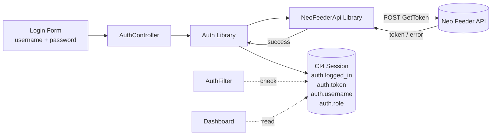

## 1. Architecture Overview

### High-Level Flow

The login feature follows a server-side rendering architecture using CodeIgniter 4. All authentication logic runs on the server; the browser receives fully rendered HTML pages. The Neo Feeder API is the sole source of truth for user authentication.

```
Sequence Diagram:

Browser                     AuthController              Auth Library            NeoFeederApi Library        Neo Feeder API
  |                               |                           |                         |                         |
  |-- GET /login ---------------->|                           |                         |                         |
  |                               |-- render login view       |                         |                         |
  |<-- HTML login form -----------|                           |                         |                         |
  |                               |                           |                         |                         |
  |-- POST /login (user,pass) --->|                           |                         |                         |
  |                               |-- Auth::login(u,p) ------>|                         |                         |
  |                               |                           |-- NeoFeederApi::        |                         |
  |                               |                           |   getToken(u,p) ------->|                         |
  |                               |                           |                         |-- POST /ws/live2.php -->|
  |                               |                           |                         |   (GetToken)            |
  |                               |                           |                         |<-- {token} -------------|
  |                               |                           |<-- {token,role} --------|                         |
  |                               |                           |                         |                         |
  |                               |                           |-- store in session      |                         |
  |                               |<-- success ---------------|                         |                         |
  |                               |                           |                         |                         |
  |<-- redirect /dashboard -------|                           |                         |                         |
  |                               |                           |                         |                         |
  |-- GET /dashboard ------------>|                           |                         |                         |
  |                               |-- AuthFilter checks       |                         |                         |
  |                               |   Auth::isLoggedIn()      |                         |                         |
  |                               |<-- valid session ---------|                         |                         |
  |<-- HTML dashboard ------------|                           |                         |                         |
```

### Architecture Diagram (Mermaid)

```mermaid
graph TD
    Browser[Browser / Client]
    Router[CI4 Router]

    subgraph "CI4 Application"
        Router
        AuthController[AuthController<br/>login() / logout()]
        DashboardController[DashboardController<br/>index()]
        AuthFilter[AuthFilter<br/>before()]

        subgraph "Services Layer"
            AuthService[Auth Library<br/>login / logout / isLoggedIn]
            NeoFeederApi[NeoFeederApi Library<br/>getToken / call]
        end

        subgraph "Views"
            LoginView[auth/login.php]
            AdminLTELayout[layouts/adminlte.php]
            DashboardView[dashboard/index.php]
        end

        Session[(CI4 Session<br/>FileHandler)]
    end

    subgraph "External"
        NeoFeederAPI[(Neo Feeder<br/>WS API<br/>51.79.235.64:8100)]
    end

    Browser --> Router
    Router --> AuthController
    Router --> DashboardController

    DashboardController -.-> AuthFilter
    AuthFilter -.-> AuthService

    AuthController --> AuthService
    AuthController --> LoginView
    AuthService --> NeoFeederApi
    NeoFeederApi --> NeoFeederAPI
    AuthService --> Session
    DashboardController --> AdminLTELayout
    DashboardController --> DashboardView
```

### Key Architectural Decisions

| Decision | Choice | Rationale |
|----------|--------|-----------|
| Rendering strategy | Server-side (no SPA) | CI4 is a server-side framework; AdminLTE is designed for server-rendered templates. No need for client-side JS framework. |
| Auth strategy | Session-based (CI4 native Session) | Spec requires session-based auth. Simpler than JWT for server-rendered apps. CI4 Session provides encryption, HTTP-only cookies, and regeneration. |
| API client | CI4 HTTP Client (CURLRequest) | Spec mandates no external packages. CURLRequest is built into CI4 and provides configurable timeout, error handling, and PSR-7 compatible interface. |
| Service registration | CI4 Services | Enables dependency injection via `service('auth')` and `service('neo-feeder')`, making components testable and interchangeable. |
| Route protection | CI4 Filter (before) | Standard CI4 mechanism for intercepting requests. Lighter than controller constructor checks and works at the routing level. |
| Role storage | Session data | Role is fetched from Neo Feeder at login time and stored in session. Avoids additional API calls on every request. |

## 2. Component Design

### 2.1 AuthController (`app/Controllers/AuthController.php`)

**Responsibility:** Handle login page display, login form submission, and logout actions.

**Interfaces:**
- `AuthController::login()` -- GET: render login view; POST: validate credentials, call Auth service, redirect or show error
- `AuthController::logout()` -- destroy session, redirect to login

**Dependencies:**
- `Config\Services::auth()` -- Auth library
- `Config\Services::session()` -- CI4 Session
- `Config\Services::request()` -- Incoming request for form data

**Key Behaviors:**
- On GET `/login`: render `Views/auth/login.php` with any flashdata errors
- On POST `/login`: validate that username and password are non-empty, call `Auth::login()`, redirect to `/dashboard` on success, otherwise set flashdata error and redirect back to `/login`
- On GET `/logout`: call `Auth::logout()`, redirect to `/login`

### 2.2 DashboardController (`app/Controllers/DashboardController.php`)

**Responsibility:** Serve the post-login landing page.

**Interfaces:**
- `DashboardController::index()` -- render dashboard view within AdminLTE layout

**Dependencies:**
- `Config\Services::auth()` -- verify logged-in status (via AuthFilter)
- `Views/layouts/adminlte.php` -- main layout
- `Views/dashboard/index.php` -- dashboard content

**Key Behaviors:**
- Renders within AdminLTE layout with sidebar showing user info from session

### 2.3 Auth Library (`app/Libraries/Auth.php`)

**Responsibility:** Encapsulate all authentication logic. Single entry point for controllers and filters.

**Interfaces:**
- `Auth::login(string $username, string $password): array` -- calls NeoFeederApi, on success stores session data, returns result array with `success` and `message`
- `Auth::logout(): void` -- destroys session
- `Auth::isLoggedIn(): bool` -- checks if `logged_in` key exists and is true in session
- `Auth::getCurrentUser(): ?array` -- returns session user data (username, role, token) or null
- `Auth::getToken(): ?string` -- returns the Neo Feeder API token from session

**Dependencies:**
- `Config\Services::neo-feeder()` -- NeoFeederApi library
- `Config\Services::session()` -- CI4 Session

**Session Data Structure** (stored under `auth` namespace key):

```php
[
    'logged_in'  => true,
    'username'   => 'user@example.com',
    'token'      => 'abc123def456...',
    'role'       => 'admin',          // from Neo Feeder response
    'login_time' => 1718100000,       // Unix timestamp
    'ip_address' => '192.168.1.100',  // Client IP at login time
]
```

**Key Behaviors:**
- `login()`: Delegate API call to NeoFeederApi::getToken(). If successful, store data in session under `auth` key, regenerate session ID. Return `['success' => true]`. On failure, return `['success' => false, 'message' => '...']`.
- `logout()`: Call `session()->destroy()` to completely remove all session data.
- `isLoggedIn()`: Check `session()->get('auth.logged_in') === true`.
- All methods check that the session segment exists before reading.

### 2.4 NeoFeederApi Library (`app/Libraries/NeoFeederApi.php`)

**Responsibility:** HTTP client wrapper for Neo Feeder Web Service API. Handles request construction, sending, response parsing, and error handling.

**Interfaces:**
- `NeoFeederApi::getToken(string $username, string $password): array` -- send GetToken request, return parsed response
- `NeoFeederApi::call(string $act, array $params = [], ?string $token = null): array` -- generic method for future API calls

**Dependencies:**
- `Config\Services::curlrequest()` -- CI4 HTTP Client (CURLRequest)
- `Config\NeoFeeder` -- API endpoint URL and timeout settings

**Key Behaviors:**
- `getToken()`: Build request body `{"act":"GetToken","username":"...","password":"..."}`, POST to configured endpoint URL with 30-second timeout.
- On successful HTTP response: Decode JSON body. If `error_code === 0` and `data.token` exists, return `['success' => true, 'token' => '...', 'role' => '...']`. If `error_code !== 0`, return `['success' => false, 'message' => derived from error_desc or default]`.
- On connection/HTTP errors: Catch `CodeIgniter\HTTP\Exceptions\HTTPException`, return `['success' => false, 'message' => 'Unable to connect to the authentication server. Please try again later.']`.
- Credentials are never logged, stored, or cached locally (NFR-01).
- Password is NOT included in any return value.

### 2.5 AuthFilter (`app/Filters/AuthFilter.php`)

**Responsibility:** Intercept requests to protected routes and verify authentication. Redirect unauthenticated users to login page.

**Interfaces (CI4 Filter interface):**
- `AuthFilter::before(RequestInterface $request, $arguments = null)` -- check auth, redirect or allow
- `AuthFilter::after(RequestInterface $request, ResponseInterface $response, $arguments = null)` -- no-op pass-through

**Dependencies:**
- `Config\Services::auth()` -- Auth library

**Key Behaviors:**
- In `before()`: Call `Auth::isLoggedIn()`. If false, redirect to `/login` with the intended URL stored as a flashdata variable (`redirect_url`) so the user can be sent back after login. If true, allow request to proceed. Role-based access control is not enforced at this stage but the architecture supports it via future `$arguments` parameter.

### 2.6 Views

#### `app/Views/auth/login.php`

**Responsibility:** Render AdminLTE 3.2 styled login page with username/password form.

**Content:**
- AdminLTE login page markup using AdminLTE CSS classes (`login-page`, `login-box`, `card`, `card-body`, etc.)
- BASE branding/logo at the top
- Email input field (type="email", name="username")
- Password input field (type="password", name="password")
- "Login" submit button with AdminLTE styling
- Error message area (Bootstrap alert) that displays flashdata errors
- CSRF hidden field (using CI4 `csrf_token()` and `csrf_hash()`)
- Form action points to `base_url('login')` POST

#### `app/Views/layouts/adminlte.php`

**Responsibility:** Main application layout for authenticated pages. Includes AdminLTE navbar (with user dropdown and logout link), sidebar, content wrapper, and footer.

**Content:**
- DOCTYPE html with `<html>` tag
- `<head>` with AdminLTE CSS/JS asset links, title variable
- `<body class="hold-transition sidebar-mini">`
- Navbar: brand logo, user info dropdown with "Logout" link pointing to `base_url('logout')`
- Sidebar: user panel, navigation menu (extensible for future features)
- Content wrapper: renders `$content` variable
- Footer: application info
- AdminLTE/ Bootstrap JS includes

### 2.7 Configuration Files

#### `app/Config/NeoFeeder.php`

**Responsibility:** Store Neo Feeder API connection parameters.

**Properties:**
- `public string $baseUrl = 'http://51.79.235.64:8100/ws/live2.php'` -- default endpoint (overridable via `.env`)
- `public int $timeout = 30` -- connection timeout in seconds
- `public int $connectTimeout = 10` -- connection handshake timeout

#### `app/Config/Routes.php` (modified)

Add login, logout, dashboard, and protected route group.

#### `app/Config/Filters.php` (modified)

Register `auth` filter alias and apply to protected routes.

#### `app/Config/Services.php` (modified)

Register `auth` and `neo-feeder` services for dependency injection.

## 3. Data Model

### 3.1 Session Data (No Local Database Table)

The authentication system does **not** use any local database table for users. All user data is fetched from the Neo Feeder API at login time and stored in the CI4 session. The session data is stored using CI4's FileHandler driver (configurable via `.env`).

**Session Namespace:** `auth`

| Key | Type | Description | Source | Persistence |
|-----|------|-------------|--------|-------------|
| `logged_in` | bool | Authentication status | Set by Auth::login() | Session duration |
| `username` | string | Authenticated user's email/username | From login form, confirmed by API | Session duration |
| `token` | string | Neo Feeder API token for subsequent API calls | From Neo Feeder GetToken response `data.token` | Session duration |
| `role` | string | User role from Neo Feeder (e.g., "admin", "operator") | From Neo Feeder response (future: parsed from `data` or additional API call) | Session duration |
| `login_time` | int | Unix timestamp of login | Set by Auth::login() via `time()` | Session duration |
| `ip_address` | string | Client IP at login time | From `$request->getIPAddress()` | Session duration |

### 3.2 Neo Feeder API Response Format

**Success Response:**
```json
{
    "error_code": 0,
    "error_desc": "",
    "data": {
        "token": "a1b2c3d4e5f6..."
    }
}
```

**Failure Response:**
```json
{
    "error_code": 1,
    "error_desc": "Username atau password salah",
    "data": []
}
```

### 3.3 Data Flow Diagram



## 4. API Design

### 4.1 Neo Feeder GetToken Endpoint

**Endpoint:** `http://51.79.235.64:8100/ws/live2.php`

**Method:** POST

**Content-Type:** `application/json`

**Request Body:**
```json
{
    "act": "GetToken",
    "username": "<user_email_or_username>",
    "password": "<user_password>"
}
```

**Success Response (HTTP 200):**
```json
{
    "error_code": 0,
    "error_desc": "",
    "data": {
        "token": "a1b2c3d4e5f6..."
    }
}
```

**Failure Response (HTTP 200 with error):**
```json
{
    "error_code": 1,
    "error_desc": "Username atau password salah",
    "data": []
}
```

**Connection Error (HTTP timeout/unreachable):**
CI4 HTTP Client throws `CodeIgniter\HTTP\Exceptions\HTTPException`.

### 4.2 Response Parsing Logic

```
if HTTP request succeeds (status 200):
    decode JSON body
    if json_last_error() != JSON_ERROR_NONE:
        return error "Invalid response from authentication server"
    if body.error_code === 0 AND isset body.data.token:
        return success with token
    else:
        return error with user-friendly message (never expose raw error_desc)
else (HTTP failure or exception):
    return error "Unable to connect to the authentication server. Please try again later."
```

### 4.3 Error Message Mapping

| Condition | User-Facing Message |
|-----------|-------------------|
| `error_code` != 0 | "Login failed. Please check your credentials." |
| HTTP connection timeout | "Unable to connect to the authentication server. Please try again later." |
| Malformed JSON response | "Unable to connect to the authentication server. Please try again later." |
| Network error (DNS, refused) | "Unable to connect to the authentication server. Please try again later." |
| Empty username or password | "Please enter your username and password." |

## 5. Technology Stack

| Component | Technology | Rationale |
|-----------|-----------|-----------|
| Backend Framework | CodeIgniter 4.x (PHP ^8.1) | Existing project framework, mandated by NFR-05 |
| HTTP Client | CI4 CURLRequest | Built-in to CI4, no external dependencies required, supports configurable timeout and error handling (NFR-05, NFR-06) |
| Session Handling | CI4 Native Session (FileHandler driver) | Session-based auth as specified (NFR-02). Provides session encryption, HTTP-only cookies, session ID regeneration |
| Template Engine | CI4 View Renderer (PHP) | Server-side rendering, directly supports AdminLTE templates |
| Frontend UI | AdminLTE 3.2 (Bootstrap 4.6) | Specified in FR-01 and NFR-04. Provides login page template, admin layout with navbar/sidebar |
| CSS/JS Assets | AdminLTE bundled (Bootstrap 4.6, jQuery 3.x, Font Awesome 5) | Delivered via CDN or local assets. No build tooling required |
| Configuration | `.env` file + CI4 Config classes | Standard CI4 approach for environment-specific configuration (FR-06) |
| Authentication | Neo Feeder API (GetToken) | External authentication service (FR-02). No local user storage |
| Role Storage | Session-stored role | Role stored from Neo Feeder response for future use (FR-04). Not actively enforced. |

## 6. Directory Structure

The following files will be **created** or **modified** (marked with `*`):

```
docs/
|-- plans/
|   \-- login-plan.md                              [CREATED - this document]
|-- specifications/
    \-- login-spec.md                               [EXISTING - approved spec]

app/
|-- Config/
|   |-- NeoFeeder.php                               [CREATED - API configuration]
|   |-- Routes.php                                  [MODIFIED - add login/logout/dashboard routes]
|   |-- Filters.php                                 [MODIFIED - register auth filter alias]
|   |-- Services.php                                [MODIFIED - register auth, neo-feeder services]
|
|-- Controllers/
|   |-- AuthController.php                          [CREATED - login/logout actions]
|   |-- DashboardController.php                     [CREATED - post-login landing page]
|   |-- BaseController.php                          [EXISTING - no change needed]
|   \-- Home.php                                    [EXISTING - no change]
|
|-- Libraries/
|   |-- Auth.php                                    [CREATED - authentication service]
|   \-- NeoFeederApi.php                            [CREATED - HTTP client wrapper]
|
|-- Filters/
|   \-- AuthFilter.php                              [CREATED - route protection middleware]
|
|-- Views/
|   |-- auth/
|   |   \-- login.php                               [CREATED - AdminLTE login form]
|   |-- layouts/
|   |   \-- adminlte.php                            [CREATED - main AdminLTE layout]
|   |-- dashboard/
|   |   \-- index.php                               [CREATED - dashboard landing content]
|   |-- errors/                                     [EXISTING - no change]
|   \-- welcome_message.php                          [EXISTING - will be replaced by dashboard]
|
\-- .env                                            [MODIFIED - add NEO_FEEDER configuration vars]
```

**Full proposed tree:**

```
app/
|-- Config/
|   |-- NeoFeeder.php
|   |-- Routes.php
|   |-- Filters.php
|   |-- Services.php
|   |-- ... (other existing config files unchanged)
|-- Controllers/
|   |-- AuthController.php
|   |-- DashboardController.php
|   |-- BaseController.php
|   |-- Home.php
|-- Libraries/
|   |-- Auth.php
|   |-- NeoFeederApi.php
|-- Filters/
|   |-- AuthFilter.php
|-- Views/
|   |-- auth/
|   |   |-- login.php
|   |-- layouts/
|   |   |-- adminlte.php
|   |-- dashboard/
|   |   |-- index.php
|   |-- welcome_message.php
|   |-- errors/
|       |-- ... (existing error views)
```

## 7. Milestones

Implementation is organized into logical task groups. Each group represents a deliverable that can be built and tested independently (where possible).

| # | Milestone | Description | Dependencies | Estimated Effort |
|---|-----------|-------------|--------------|------------------|
| M1 | Configuration Layer | Create `Config/NeoFeeder.php`, update `.env` with Neo Feeder URL/timeout settings | None | Small |
| M2 | NeoFeederApi Library | Create `Libraries/NeoFeederApi.php` with `getToken()` method, implement CI4 HTTP Client integration with error handling | M1 | Medium |
| M3 | Auth Library | Create `Libraries/Auth.php` with login, logout, isLoggedIn, getCurrentUser, getToken methods | M2 | Medium |
| M4 | AuthController + Login View | Create `Controllers/AuthController.php` (login GET/POST, logout) and `Views/auth/login.php` (AdminLTE login form) | M3 | Medium |
| M5 | AuthFilter | Create `Filters/AuthFilter.php` with route interception | M3 | Small |
| M6 | Dashboard + AdminLTE Layout | Create `Controllers/DashboardController.php`, `Views/layouts/adminlte.php`, `Views/dashboard/index.php` | M4 | Medium |
| M7 | Route/Filter/Service Wiring | Update `Config/Routes.php`, `Config/Filters.php`, `Config/Services.php` to wire all components together | M4, M5, M6 | Small |
| M8 | Integration & Error Handling | End-to-end testing: successful login flow, failed login flow, connection error handling, protected route redirection, logout | M7 | Medium |

### Recommended Implementation Order

1. **M1** (Configuration) -- foundational, no dependencies
2. **M2** (NeoFeederApi Library) -- core external communication
3. **M3** (Auth Library) -- core auth logic
4. **M5** (AuthFilter) -- can be built once Auth library is ready
5. **M4** (AuthController + Login View) -- needs Auth library and filter
6. **M6** (Dashboard + Layout) -- needs AuthController for context
7. **M7** (Wiring) -- needs all components
8. **M8** (Integration) -- needs everything wired

## 8. Risks

| # | Risk | Impact | Likelihood | Mitigation |
|---|------|--------|------------|------------|
| R1 | Neo Feeder API is unreachable or down | Users cannot log in. Application becomes unusable. | Medium | Implement graceful error messaging (see Section 4.3). Show clear "server unavailable" message. Avoid any crash or stack trace exposure. |
| R2 | Neo Feeder API returns unexpected response format (structure change) | Login fails or token extraction breaks. | Low | Add JSON schema validation after decoding. If response lacks expected fields, return generic error rather than crashing. |
| R3 | HTTP (not HTTPS) connection is a security concern | Credentials transmitted in plaintext over network. | High (for production) | This is an accepted limitation of the external service (per spec NFR-01). Token-based subsequent calls mitigate repeated password transmission. Consider future VPN/tunnel if security requirements increase. |
| R4 | Session timeout during active use | User is unexpectedly redirected to login page, losing unsaved work. | Medium | Implement session timeout warning (future enhancement). For initial release, ensure redirect preserves intended URL via flashdata so user can resume. |
| R5 | Neo Feeder API slow response times | Login page appears to hang. User may attempt multiple submissions. | Medium | Set connect timeout (10s) and overall timeout (30s). Disable submit button after first click to prevent duplicate requests. Show loading indicator. |
| R6 | Token expiration mid-session | Subsequent API calls fail with auth error. | Medium | Auth library should expose `getToken()` for other services. Future: implement token refresh or re-login prompt when API returns token error. |
| R7 | CSRF token mismatch on login form | Login POST fails with CSRF error. User sees generic error. | Low | CI4 CSRF filter is enabled by default. Ensure login view includes CSRF field. Test form submission thoroughly. |

## 9. Changelog

| Version | Date | Author | Changes |
|---------|------|--------|---------|
| 0.1 | 2026-06-12 | - | Initial draft -- complete technical plan for Login feature |
| 0.2 | 2026-06-12 | - | Removed hasRole method, RBAC references, and role-checking from AuthFilter following spec v0.5 (RBAC removed from active scope). |
