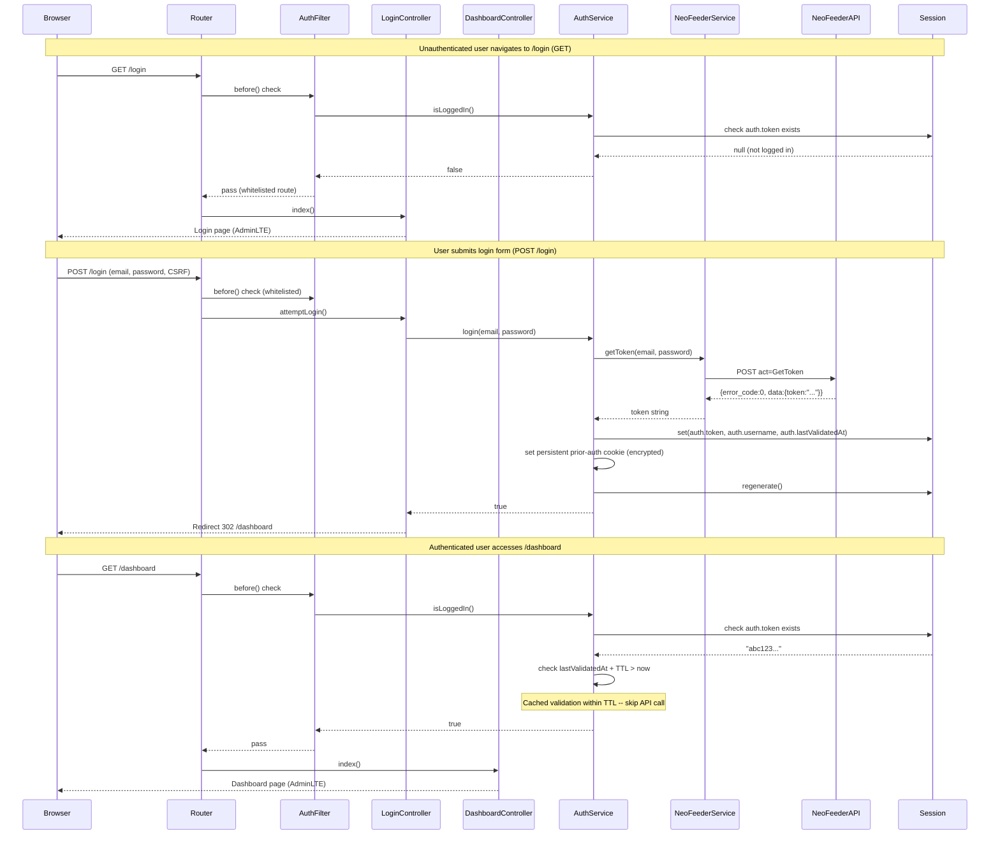
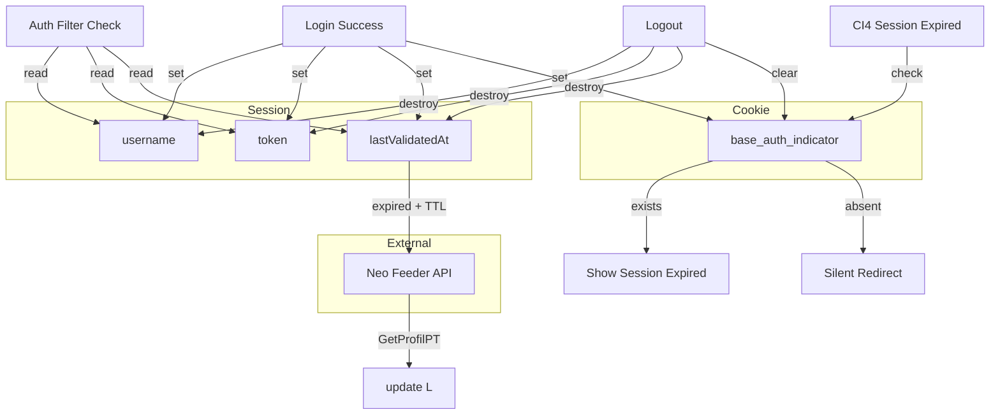
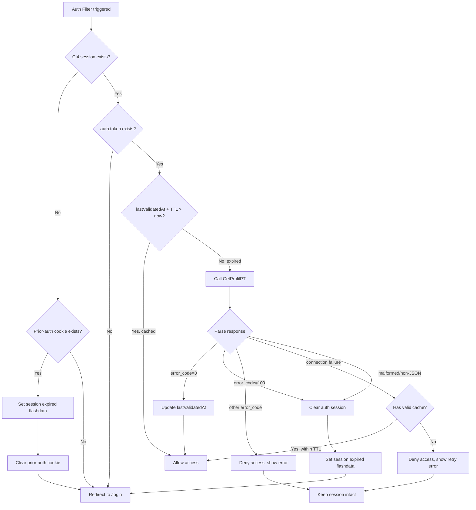

## Architecture Overview

### High-Level Architecture

The Login feature follows a layered architecture within the CodeIgniter 4 MVC framework. Authentication is session-based, with the Neo Feeder Web Service as the external identity provider. No local user database is used.

```
                +-------------------+
                |   Web Browser     |
                | (AdminLTE UI)     |
                +--------+----------+
                         |
               HTTP Request/Response
                         |
                +--------v----------+
                |   CI4 Router      |
                +--------+----------+
                         |
            +------------+------------+
            |                         |
    +-------v--------+       +--------v-------+
    | Auth Filter    |       |  Public        |
    | (global before)|       |  /login route  |
    +-------+--------+       +--------+-------+
            |                         |
            | (if not auth)           |
            | redirect /login         |
            |                         |
    +-------v--------+       +--------v-------+
    | Controllers    |       | LoginController|
    | (protected)    |       | (unauthenticated)
    +-------+--------+       +--------+-------+
            |                         |
            |                    +----v----+
            |                    | Auth    |
            |                    | Service |
            |                    +----+----+
            |                         |
            |                    +----v----+
            |                    |NeoFeeder|
            |                    | Service |
            |                    +----+----+
            |                         |
            |              +----------v----------+
            |              | Neo Feeder WS API   |
            |              | (external)          |
            |              +---------------------+
            |
    +-------v--------+
    | Session         |
    | (CI4 native)    |
    +-----------------+
```

### Request Flow Diagram



### Key Architectural Decisions

| Decision | Choice | Rationale |
|----------|--------|-----------|
| Auth mechanism | Session-based (CI4 native) | Matches framework conventions; no additional packages needed; token stored server-side |
| Identity provider | Neo Feeder WS API | External PDDIKTI system; no local users table required |
| Route protection | Global CI4 Filter (deny-by-default) | All routes protected unless explicitly whitelisted; single enforcement point |
| Token validation caching | Sliding TTL via session `lastValidatedAt` | Reduces API calls; configurable via `.env`; slides on each successful check |
| Session timeout detection | Persistent prior-auth indicator (encrypted cookie) | Survives CI4 session expiry; enables "session expired" messaging vs silent redirect |
| API communication | CI4 HTTP Client (CURLRequest) | Built-in; no external HTTP library needed; configurable timeouts |
| Service layer | Two dedicated classes (Auth, NeoFeeder) | Separation of concerns: Auth handles auth logic, NeoFeeder handles HTTP transport |

## Requirements Traceability

| Requirement | Plan Section(s) |
|-------------|-----------------|
| FR-01: Login Page Display | Component Design §4 (Login Controller), §6 (Views), Architecture Overview |
| FR-02: User Authentication via Neo Feeder API | Component Design §1 (NeoFeeder Service), §2 (Auth Service), §4 (Login Controller), API Design (GetToken, GetProfilPT) |
| FR-03: Protected Routes | Component Design §3 (Auth Filter), §5 (Dashboard Controller), §7 (Routes) |
| FR-05: Logout Functionality | Component Design §4 (Login Controller), §2 (Auth Service) |
| FR-06: Neo Feeder API Connection Configuration | Component Design §8 (Configuration), Milestone 1 |
| NFR-01: Credential Security | Component Design §2 (Auth Service), API Design, Data Model |
| NFR-02: Session Security | Component Design §2 (Auth Service), §3 (Auth Filter), Data Model (prior-auth cookie) |
| NFR-03: Code Extensibility & Reusability | Component Design §1 (NeoFeeder Service), §2 (Auth Service) — service layer decoupling |
| NFR-04: AdminLTE Template Compliance | Component Design §6 (Views), Technology Stack |
| NFR-05: Framework Compatibility | Technology Stack, Directory Structure |
| NFR-06: API Communication Reliability | Component Design §1 (NeoFeeder Service), API Design (error handling), Risks |
| AC-01: Login Page Renders Correctly | Component Design §4 (Login Controller), §6 (Views) |
| AC-02: Successful Login Creates Session | Component Design §1 (NeoFeeder), §2 (Auth Service), API Design §GetToken |
| AC-03: Failed Login Shows Error | Component Design §1 (NeoFeeder), §2 (Auth Service), §4 (Login Controller) |
| AC-04: Authenticated User Access | Component Design §3 (Auth Filter), §5 (Dashboard Controller) |
| AC-05: Unauthenticated Redirect | Component Design §3 (Auth Filter), §2 (Auth Service — prior-auth cookie) |
| AC-06: Logout Destroys Session | Component Design §4 (Login Controller), §2 (Auth Service) |
| AC-07: API Connection Configurable | Component Design §8 (Configuration), Directory Structure |
| AC-08: Credentials Not Stored/Logged | Component Design §2 (Auth Service), NFR-01 coverage |
| AC-09: Services Are Injectable | Component Design §8 (Configuration — Services.php), Architecture Overview |
| AC-10: Token Validation on Protected Route Access | Component Design §3 (Auth Filter), §2 (Auth Service — validateToken), API Design §GetProfilPT, Validation Caching Logic |
| AC-11: Authenticated User at Login Redirects | Component Design §3 (Auth Filter), §4 (Login Controller — index()) |

## Component Design

### 1. NeoFeeder Service (`app/Libraries/NeoFeeder.php`)

**Traces to**: FR-02, FR-06, NFR-06, AC-02, AC-03, AC-07, AC-10

**Responsibility**: Encapsulates all HTTP communication with the Neo Feeder Web Service API. Controllers and Auth service should never call the HTTP client directly.

**Interfaces**:
- `getToken(string $username, string $password): array` -- Calls `GetToken` action; returns parsed response array
- `getProfilPT(string $token): array` -- Calls `GetProfilPT` action; returns parsed response array

**Dependencies**:
- CI4 HTTP Client (`CodeIgniter\HTTP\CURLRequest`) via `service('curlrequest')`
- Config (`Config\NeoFeeder` or `.env` vars) for API base URL, timeouts

**Error Handling**:
- Connection failures (timeout, network): catch `CodeIgniter\HTTP\Exceptions\HTTPException` and return a structured error array
- Malformed JSON: catch JSON decode errors and return error array
- HTTP error codes: treat as connection failure

**Response Structure** (returned as array):
```php
// Success
['error_code' => 0, 'error_desc' => '', 'data' => ['token' => '...']]

// API error
['error_code' => 100, 'error_desc' => 'Invalid Token.', 'data' => null]

// Connection failure
['error_code' => -1, 'error_desc' => 'Unable to connect to authentication server.', 'data' => null]

// Malformed response
['error_code' => -2, 'error_desc' => 'Invalid response from server.', 'data' => null]
```

### 2. Auth Service (`app/Libraries/Auth.php`)

**Traces to**: FR-02, FR-05, NFR-01, NFR-02, NFR-03, AC-02, AC-03, AC-05, AC-06, AC-08, AC-10, AC-11

**Responsibility**: Encapsulates all authentication logic. Used by controllers and filters. Depends on NeoFeeder service for API calls.

**Interfaces**:
- `login(string $username, string $password): bool` -- Authenticates via NeoFeeder, creates session on success, returns true. On failure returns false; call `getLastError()` to retrieve the error message string for display.
- `getLastError(): ?string` -- Returns the last error message (e.g., "Login failed. Please check your credentials.") or null if no error.
- `logout(): void` -- Destroys session, clears prior-auth cookie
- `isLoggedIn(): bool` -- Checks session for auth.token (with optional validation caching)
- `getCurrentUser(): ?string` -- Returns username from session or null
- `validateToken(): bool` -- Forces token validation via GetProfilPT (used by Auth Filter)

**Internal Methods**:
- `getValidationTTL(): int` -- Reads TTL from config/.env (default 300s)
- `setPriorAuthCookie(): void` -- Sets signed/encrypted persistent cookie
- `clearPriorAuthCookie(): void` -- Deletes persistent cookie
- `hasPriorAuthCookie(): bool` -- Checks for presence of persistent cookie

**Dependencies**:
- NeoFeeder service (`service('neoFeeder')`)
- CI4 Session (`service('session')`)
- CI4 Encryption (`service('encryption')`)
- Config for validation TTL

**Session Schema** (under `auth` namespace):
| Key | Type | Description |
|-----|------|-------------|
| `username` | string | Authenticated user's email |
| `token` | string | Neo Feeder API token |
| `lastValidatedAt` | int | Unix timestamp of last successful token validation |

### 3. Auth Filter (`app/Filters/AuthFilter.php`)

**Traces to**: FR-03, NFR-02, AC-04, AC-05, AC-10, AC-11

**Responsibility**: CI4 Filter that protects routes. Applied globally via filter config.

**Interfaces**:
- `before(RequestInterface $request, $arguments = null)` -- Checks authentication; redirects if not authenticated

**Logic**:
1. Skip check if route is in whitelist (login routes)
2. Call `AuthService::isLoggedIn()`
3. If not logged in:
   - If `AuthService::hasPriorAuthCookie()` is true: set "session expired" flashdata, clear cookie, redirect to `/login`
   - Else: redirect to `/login` without flashdata
4. If logged in: allow request

**Whitelist**:
- Login routes: `'login'` (matches both GET and POST to `/login`)
- Static assets are served by the web server directly from `public/`, not through CI4 routing — no whitelist needed

**Filter Config Syntax** (in `app/Config/Filters.php`):
```php
public $aliases = [
    'auth' => \App\Filters\AuthFilter::class,
];

public $globals = [
    'before' => [
        'auth' => ['except' => ['login*']],
    ],
];
```
The `'except' => ['login*']` pattern whitelists all routes starting with `login`. This covers both GET and POST `/login`.

### 4. Login Controller (`app/Controllers/Login.php`)

**Traces to**: FR-01, FR-02, FR-05, AC-01, AC-02, AC-03, AC-06, AC-11

**Responsibility**: Handles login page display, login form submission, and logout.

**Methods**:
- `index()` -- GET `/login`: Display AdminLTE-styled login page. If user already authenticated, redirect to `/dashboard`.
- `attemptLogin()` -- POST `/login`: Validate input, call AuthService::login(), handle success/error responses.
- `logout()` -- POST `/logout`: Call AuthService::logout(), redirect to `/login`.

**Input Validation**:
- Username and password must be non-empty strings
- No format/length validation beyond non-empty (delegated to Neo Feeder)

**Flashdata Keys** (CI4 flashdata for view notifications):
- `error` -- Error message string (login failure, connection error, validation error)
- `message` -- Success/info message string (session expired notification)
- Keys are set via `session()->setFlashdata('error', '...')` and displayed in the login view

### 5. Dashboard Controller (`app/Controllers/Dashboard.php`)

**Traces to**: FR-03, AC-04

**Responsibility**: Minimal protected stub page as post-login landing target.

**Methods**:
- `index()` -- GET `/dashboard`: Render welcome view with authenticated username within AdminLTE layout.

### 6. Views

**Traces to**: FR-01, NFR-04, AC-01

**`app/Views/login/login.php`**:
- AdminLTE 3.2 login page template
- BASE branding/logo
- Email input, password input, CSRF hidden field, Login button
- Error message display area (session flashdata)
- Responsive design

**`app/Views/dashboard/index.php`**:
- Minimal AdminLTE content page
- Welcome message displaying authenticated username
- Navigation bar with logout button

**`app/Views/layout/`**:
- Shared AdminLTE template partials used by all authenticated pages
- `header.php` -- navbar with logout button, CSS includes
- `footer.php` -- JavaScript includes, closing tags
- `sidebar.php` -- AdminLTE sidebar (can be minimal/stub for now)

### 7. Routes (`app/Config/Routes.php`)

**Traces to**: FR-01, FR-03, FR-05, AC-01, AC-04

```php
$routes->get('/login', 'Login::index');
$routes->post('/login', 'Login::attemptLogin');
$routes->post('/logout', 'Login::logout');
$routes->get('/dashboard', 'Dashboard::index');
```

### 8. Configuration

**Traces to**: FR-06, NFR-02, NFR-05, AC-07, AC-09

**`app/Config/NeoFeeder.php`** (new config file):
```php
namespace Config;

use CodeIgniter\Config\BaseConfig;

class NeoFeeder extends BaseConfig
{
    public string $apiBaseUrl = 'https://neofeeder.stiem-bongaya.ac.id/ws/live2.php';
    public int $connectionTimeout = 10;   // seconds
    public int $requestTimeout = 30;      // seconds
    public int $validationTTL = 300;      // seconds (5 minutes)
}
```

**.env additions**:
```ini
neofeeder.apiBaseUrl = https://neofeeder.stiem-bongaya.ac.id/ws/live2.php
neofeeder.connectionTimeout = 10
neofeeder.requestTimeout = 30
neofeeder.validationTTL = 300
encryption.key = <base64-random-key>
```

**`app/Config/Filters.php`** modifications:
- Add `auth` filter alias pointing to `\App\Filters\AuthFilter::class`
- Add `auth` to `$globals['before']` array
- Whitelist `login` route pattern in filter config

**`app/Config/Services.php`** modifications:
- Register `auth` service returning `\App\Libraries\Auth` singleton
- Register `neoFeeder` service returning `\App\Libraries\NeoFeeder` singleton

**`app/Config/Security.php`** modifications:
- Uncomment/set `csrfProtection` to `'cookie'` (already default)
- Ensure CSRF globals filter is enabled for POST routes

**`app/Config/Session.php`** modifications:
- Set `$expiration = 7200` (default 120 minutes)
- Ensure encrypt mode is enabled via session config (CI4 handles via `encryption.key`)

## Data Model

### Session Schema

No database tables are created for authentication. All auth state is stored in the CI4 session under the `auth` namespace.

```
Session (CI4 native session)
  |
  +-- auth (namespace/array)
  |     +-- username: string        -- e.g., "admin@stiem-bongaya.ac.id"
  |     +-- token: string           -- e.g., "a1b2c3d4e5f6..."
  |     +-- lastValidatedAt: int    -- e.g., 1718730000 (Unix timestamp)
  |
  +-- csrf_token: string            -- (CI4 internal, CSRF protection)
```

### Persistent Prior-Auth Indicator (Cookie)

```
Name:    base_auth_indicator
Value:   encrypted(signed(username + '|' + token_hash))
Expires: +24 hours
Path:    /
Secure:  true (if HTTPS)
HTTPOnly: true
SameSite: Lax
```

- Created on successful login (set by AuthService)
- Cleared on logout
- Checked by AuthFilter when no valid CI4 session exists, to differentiate "session expired" from "never logged in"
- Encrypted using CI4 Encryption service with the same `encryption.key` from `.env`

### Data Flow Diagram



## API Design

### Neo Feeder Web Service API Integration

**Base URL**: `https://neofeeder.stiem-bongaya.ac.id/ws/live2.php`

**Common Headers**:
```
Content-Type: application/json
Accept: application/json
```

### GetToken (Login)

**Request**:
```
POST https://neofeeder.stiem-bongaya.ac.id/ws/live2.php
Content-Type: application/json

{
    "act": "GetToken",
    "username": "user@example.com",
    "password": "user_password"
}
```

**Success Response** (`error_code: 0` with valid token):
```json
{
    "error_code": 0,
    "error_desc": "",
    "data": {
        "token": "a1b2c3d4e5f67890abcdef1234567890"
    }
}
```
> Action: Create session, redirect to /dashboard

**Success Response** (`error_code: 0` without valid token):
```json
{
    "error_code": 0,
    "error_desc": "",
    "data": {
        "token": null
    }
}
```
> Action: Treat as failed login. Show "Login failed. Please check your credentials."

**Failure Response** (invalid credentials):
```json
{
    "error_code": 1,
    "error_desc": "Username atau password salah.",
    "data": null
}
```
> Action: Show "Login failed. Please check your credentials."

**Connection Failure**:
> Action: Show "Unable to connect to the authentication server. Please try again later."

### GetProfilPT (Token Validation)

**Request**:
```
POST https://neofeeder.stiem-bongaya.ac.id/ws/live2.php
Content-Type: application/json

{
    "act": "GetProfilPT",
    "token": "a1b2c3d4e5f67890abcdef1234567890"
}
```

**Success Response** (valid token):
```json
{
    "error_code": 0,
    "error_desc": "",
    "data": {
        "id_perguruan_tinggi": "...",
        "nama_pt": "...",
        "kode_perguruan_tinggi": "...",
        "id_status_mil": 2,
        "sk_pendirian": "...",
        "tanggal_sk_pendirian": "...",
        "id_wilayah": "...",
        "nama_wilayah": "...",
        "lintang": null,
        "bujur": null
    }
}
```
> Action: Update lastValidatedAt, allow access

**Invalid Token Response** (`error_code: 100`):
```json
{
    "error_code": 100,
    "error_desc": "Invalid Token. Token tidak ada atau token sudah expired.",
    "data": null
}
```
> Action: Clear auth session, redirect to /login with "session expired" notification

**Other Error Response** (e.g., `error_code: 1` or `99`):
```json
{
    "error_code": 1,
    "error_desc": "Some other error.",
    "data": null
}
```
> Action: Deny access, show "Unable to verify session. Please try again later.", keep session intact

**Connection Failure**:
> Action: Use cached result if within TTL; else deny access, show retry error, keep session intact

**Malformed/Non-JSON Response**:
> Action: Treat as invalid token, clear session, redirect to login with "session expired"

### Validation Caching Logic



## Technology Stack

| Component | Technology | Rationale |
|-----------|-----------|-----------|
| Framework | CodeIgniter 4.x (system/) | Existing project framework; built-in session, filter, HTTP client support |
| Language | PHP ^8.1 | Required by composer.json; matches project constraint |
| UI Template | AdminLTE 3.2 (almasaeed2010/adminlte) | Already in composer.json; consistent admin dashboard UI |
| Session Handling | CI4 Native Sessions (FileHandler) | No database overhead; filesystem-backed; encryption via encryption.key |
| HTTP Client | CI4 CURLRequest | Built-in; no external dependency; configurable timeouts; HTTPS support |
| Encryption | CI4 Encryption Service | Used for persistent prior-auth cookie; uses same key as session encryption |
| CSRF Protection | CI4 Security (CSRF) | Built-in; cookie-based; enabled on login form |
| API Protocol | JSON over HTTPS | Neo Feeder API uses JSON exclusively; no SOAP/XML needed |
| Database | MySQL | Project requirement; not used for auth (no local users table) |
| Environment Config | `.env` file | CI4-native; overrides Config class values at runtime |

## Directory Structure

### File Inventory (all affected files)

**NEW files to create** (8 files):
- `app/Config/NeoFeeder.php`
- `app/Controllers/Login.php`
- `app/Controllers/Dashboard.php`
- `app/Filters/AuthFilter.php`
- `app/Libraries/Auth.php`
- `app/Libraries/NeoFeeder.php`
- `app/Views/login/login.php`
- `app/Views/dashboard/index.php`
- `app/Views/layout/header.php`
- `app/Views/layout/footer.php`
- `app/Views/layout/sidebar.php`

**MODIFY files** (4 files):
- `app/Config/Filters.php`
- `app/Config/Services.php`
- `app/Config/Routes.php`
- `.env`

**REVIEW files** (2 files, no changes expected):
- `app/Config/Security.php`
- `app/Config/Session.php`

### Directory Tree

```
app/
|-- Config/
|   |-- NeoFeeder.php                    [NEW]
|   |-- Filters.php                      [MODIFY]
|   |-- Services.php                     [MODIFY]
|   |-- Routes.php                       [MODIFY]
|-- Controllers/
|   |-- Login.php                        [NEW]
|   |-- Dashboard.php                    [NEW]
|-- Filters/
|   |-- AuthFilter.php                   [NEW]
|-- Libraries/
|   |-- Auth.php                         [NEW]
|   |-- NeoFeeder.php                    [NEW]
|-- Views/
|   |-- login/
|   |   |-- login.php                    [NEW]
|   |-- dashboard/
|   |   |-- index.php                    [NEW]
|   |-- layout/
|       |-- header.php                   [NEW]
|       |-- footer.php                   [NEW]
|       |-- sidebar.php                  [NEW]

.env                                     [MODIFY]
```

## Milestones

### Milestone 1: Foundation and Configuration
**Requirement(s)**: FR-06, NFR-02, NFR-05, AC-07, AC-09
**Goal**: Set up configuration files, service registrations, and route definitions.

- Create `app/Config/NeoFeeder.php` with API base URL, timeouts, TTL
- Add `.env` entries for NeoFeeder config and `encryption.key`
- Modify `app/Config/Services.php` to register `auth` and `neoFeeder` services
- Modify `app/Config/Routes.php` to add login, logout, dashboard routes
- Verify service registration works via `php spark routes`

**Deliverables**: Config files, service registration, routes

### Milestone 2: Neo Feeder API Service
**Requirement(s)**: FR-02, FR-06, NFR-06, AC-02, AC-03, AC-07, AC-10
**Goal**: Implement the HTTP communication layer for Neo Feeder Web Service.

- Create `app/Libraries/NeoFeeder.php` with `getToken()` and `getProfilPT()` methods
- Implement CI4 HTTP Client integration with configurable timeouts
- Implement error handling: connection failures, HTTP errors, malformed responses
- Test with actual Neo Feeder endpoint (or mock)

**Deliverables**: NeoFeeder library ready for integration

### Milestone 3: Authentication Service
**Requirement(s)**: FR-02, FR-05, NFR-01, NFR-02, NFR-03, AC-02, AC-03, AC-05, AC-06, AC-08, AC-10, AC-11
**Goal**: Implement the authentication logic layer.

- Create `app/Libraries/Auth.php` with `login()`, `logout()`, `isLoggedIn()`, `getCurrentUser()`, `validateToken()`
- Implement session management under `auth` namespace
- Implement validation caching logic (TTL-based sliding)
- Implement persistent prior-auth indicator (encrypted cookie)
- Implement session regeneration on login

**Deliverables**: Auth library ready for controller/filter integration

### Milestone 4: Auth Filter (Route Protection)
**Requirement(s)**: FR-03, NFR-02, AC-04, AC-05, AC-10, AC-11
**Goal**: Implement the global route protection filter.

- Create `app/Filters/AuthFilter.php`
- Modify `app/Config/Filters.php`: add auth alias, configure global before filter, whitelist login routes
- Implement logic: session check, prior-auth detection, flashdata messaging, redirects
- Implement "authenticated user at /login" redirect to /dashboard

**Deliverables**: Route protection active, filter integration complete

### Milestone 5: Login Controller and Views
**Requirement(s)**: FR-01, FR-02, FR-05, NFR-04, AC-01, AC-02, AC-03, AC-06, AC-11
**Goal**: Implement the login page UI and form handling.

- Create `app/Controllers/Login.php` with `index()`, `attemptLogin()`, `logout()`
- Create AdminLTE-styled views:
  - `app/Views/login/login.php`
  - `app/Views/layout/header.php`
  - `app/Views/layout/footer.php`
  - `app/Views/layout/sidebar.php`
- Implement input validation (non-empty check)
- Implement error/success flashdata messaging
- Test full login flow end-to-end

**Deliverables**: Working login page and authentication flow

### Milestone 6: Dashboard Stub Page
**Requirement(s)**: FR-03, AC-04
**Goal**: Implement the protected dashboard landing page.

- Create `app/Controllers/Dashboard.php` with `index()`
- Create `app/Views/dashboard/index.php` with welcome message and username display
- Integrate with AdminLTE layout (navbar with logout button)

**Deliverables**: Protected dashboard accessible after login

## Risks

| # | Risk | Impact | Likelihood | Mitigation |
|---|------|--------|------------|------------|
| 1 | Neo Feeder API is unreachable or slow | Users cannot log in; protected routes may deny access | Medium | Configurable timeouts; graceful error messages; cached validation allows continued access during brief outages |
| 2 | Neo Feeder API changes response format | Authentication breaks | Low | Abstract response parsing in NeoFeeder service; isolate parsing logic for easy updates |
| 3 | Session encryption key not set | Session/cookie encryption fails; security warning | High | Document `encryption.key` requirement in `.env`; CI4 will error if missing; add check in Auth service constructor |
| 4 | AdminLTE template integration conflicts | UI rendering issues | Low | AdminLTE already in composer.json; follow AdminLTE 3.2 documentation for login page structure |
| 5 | CSRF blocking AJAX or form submissions | Login form fails to submit (for new developers) | Medium | CI4 CSRF is cookie-based by default; form helper `csrf_field()` provides hidden input automatically |
| 6 | Session file permissions on shared hosting | Session creation/write failures | Low | CI4 FileHandler defaults to `writable/session`; ensure directory is writable; document in setup |
| 7 | Token validation TTL too short or too long | Too short: excessive API calls; too long: delayed invalidation | Low | TTL is configurable via `.env`; default 300s is reasonable balance; adjust per environment |
| 8 | Persistent prior-auth cookie decryption failure | "Session expired" false positives | Low | Use CI4 Encryption service consistently; same key for encryption and decryption; clear cookie if decryption fails |
| 9 | Neo Feeder API's GetProfilPT returns error_code=0 for expired tokens | Expired sessions remain valid | Low | This is a risk with any external auth provider; rely on CI4 session timeout as secondary enforcement |

## Changelog

| Version | Date | Author | Changes |
|---------|------|--------|---------|
| 0.1 | 2026-06-18 | sdd-plan (big-pickle) | Initial draft -- technical plan for login feature based on approved specification v0.14 |
| 0.2 | 2026-06-18 | plan-orchestrator (big-pickle) | Added Requirements Traceability Matrix (P-01); added Traces-to annotations to all components (P-02); added requirement mappings to milestones (P-03) |
| 0.3 | 2026-06-18 | plan-orchestrator (big-pickle) | Review fixes: fixed logout route to use Login::logout; made layout views required (not optional); added flashdata key naming convention; added filter whitelist config syntax example |
| 0.4 | 2026-06-18 | plan-orchestrator (big-pickle) | Second review fixes: added getLastError() method to Auth service for error differentiation; consolidated file inventory section (removed redundant Files to Modify/Review/Tree sections); fixed directory tree formatting |
