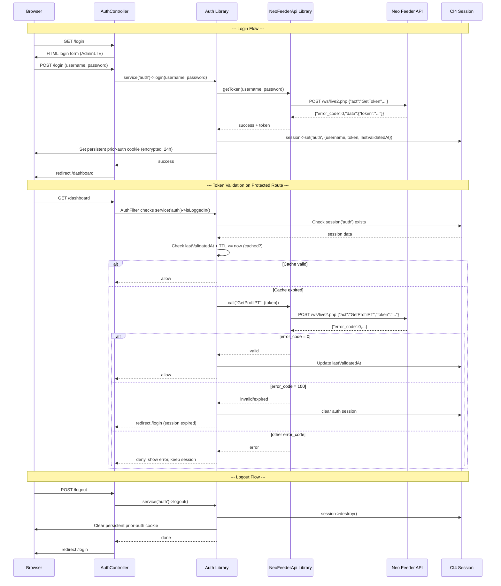

## 1. Architecture Overview

### 1.1 High-Level Sequence

The login feature follows a server-side rendering architecture using CodeIgniter 4. All authentication logic runs on the server; the browser receives fully rendered HTML pages. The Neo Feeder API at `https://neofeeder.example.com/ws/live2.php` is the sole source of truth for user authentication and token validation.



### 1.2 Architecture Diagram

```mermaid
graph TD
    Browser[Browser / Client]

    subgraph "CI4 Application"
        Router[CI4 Router]

        subgraph "Controllers"
            AuthController[AuthController<br/>login() GET+POST<br/>logout() POST]
            DashboardController[DashboardController<br/>index()]
        end

        subgraph "Services Layer"
            AuthService[Auth Library<br/>login / logout / isLoggedIn<br/>getCurrentUser / validateToken]
            NeoFeederService[NeoFeederApi Library<br/>getToken / call]
        end

        subgraph "Infrastructure"
            AuthFilter[AuthFilter<br/>before() -> validation + caching]
            Session[(CI4 Session<br/>FileHandler)]
            Cookie[Persistent Prior-Auth<br/>Encrypted Cookie (24h)]
        end

        subgraph "Views"
            LoginView[auth/login.php]
            AdminLTELayout[layouts/adminlte.php]
            DashboardView[dashboard/index.php]
        end

        Config[Config Files<br/>Routes / Filters / Services<br/>NeoFeeder / .env]
    end

    subgraph "External"
        NeoFeederAPI[(Neo Feeder<br/>WS API<br/>neofeeder.example.com)]
    end

    Browser --> Router
    Router --> AuthController
    Router --> DashboardController

    DashboardController -.-> AuthFilter
    AuthFilter --> AuthService
    AuthFilter --> Cookie

    AuthController --> AuthService
    AuthController --> Config
    AuthController --> LoginView
    AuthController --> Cookie

    AuthService --> NeoFeederService
    AuthService --> Session
    AuthService --> Cookie

    NeoFeederService --> NeoFeederAPI

    DashboardController --> AdminLTELayout
    DashboardController --> DashboardView
```

### 1.3 Key Architectural Decisions

| Decision | Choice | Rationale |
|----------|--------|-----------|
| Rendering strategy | Server-side (no SPA) | CI4 is a server-side framework; AdminLTE is designed for server-rendered templates. No client-side JS framework needed. |
| Auth strategy | Session-based (CI4 native Session) | Spec requires session-based auth. CI4 Session provides encryption, HTTP-only cookies, session ID regeneration, and flashdata support. |
| No `logged_in` flag | Auth status determined by presence of valid `token` in `auth` session namespace | Per spec v0.6. Avoids stale flag state. `isLoggedIn()` checks `session('auth.token') !== null` and validates via cached/actual GetProfilPT call. |
| Token validation caching | Sliding TTL via `lastValidatedAt` (default 300s, configurable via `.env`) | Reduces API calls on every request. Slides forward on each successful validation. Configurable for environments with slow/unstable API connectivity. |
| Persistent prior-auth indicator | Signed/encrypted cookie via CI4 Encryption service (24h lifetime) | Detects session timeout after CI4 session expires. Cookie outlasts session timeout (120 min default). Cleared on logout, set on login. |
| API client | CI4 HTTP Client (CURLRequest) | Built-in, no external packages needed. Configurable connect timeout (10s) and request timeout (30s). Good error handling. |
| Service registration | CI4 Services with camelCase names | Enables DI via `service('auth')` and `service('neoFeeder')`. Makes components testable and interchangeable per NFR-03. |
| Route protection | CI4 Filter (global deny-by-default, whitelist `/login`) | Standard CI4 mechanism. Global filter applied to all routes; `/login` whitelisted in filter config (not in routes). |
| Logout method | POST only | CSRF protection. Cannot be triggered by pre-fetched links or image tags. |
| Credential storage | Never stored locally | Passwords transmitted only to Neo Feeder API via HTTPS. Not logged, cached, or stored in database or session (per NFR-01). |

## 2. Component Design

### 2.1 AuthController (`app/Controllers/AuthController.php`)

**Responsibility:** Handle login page display, login form submission, and logout action.

**Interfaces:**

| Method | HTTP Verb | URI | Behavior |
|--------|-----------|-----|----------|
| `login()` | GET | `/login` | Render AdminLTE login view. If already authenticated, redirect to `/dashboard`. Pass any flashdata messages to view. |
| `login()` | POST | `/login` | Validate non-empty input, call `service('auth')->login($username, $password)`. On success: redirect `/dashboard`. On failure: set flashdata error and redirect back to `/login`. |
| `logout()` | POST | `/logout` | Call `service('auth')->logout()`. Redirect to `/login`. Reject GET requests (405 Method Not Allowed). |

**Dependencies:**
- `service('auth')` -- Auth library
- `service('session')` -- CI4 Session (for flashdata)
- `service('request')` -- Incoming request for form data
- CSRF filter (enabled globally for POST)

**Key Behaviors:**
- GET `/login` with authenticated user: detect via `service('auth')->isLoggedIn()`, redirect to `/dashboard` immediately (AC-11).
- GET `/login` without authenticated user: render `Views/auth/login.php` with CSRF field and any flashdata error/notification messages.
- POST `/login` validation: check `$username` and `$password` are non-empty strings. If empty: "Please enter your username and password." (AC-03).
- POST `/login` with valid credentials: `service('auth')->login()` returns `['success' => true]`. Redirect to `/dashboard`.
- POST `/login` with invalid credentials or API error: redirect back to `/login` with flashdata error message (AC-03).
- POST `/logout`: call `service('auth')->logout()`, redirect `/login`.

### 2.2 DashboardController (`app/Controllers/DashboardController.php`)

**Responsibility:** Serve the post-login landing page -- minimal protected stub.

**Interfaces:**

| Method | HTTP Verb | URI | Behavior |
|--------|-----------|-----|----------|
| `index()` | GET | `/dashboard` | Render dashboard welcome view within AdminLTE layout showing authenticated username. |

**Dependencies:**
- Protected by `AuthFilter` (automatic via route/global filter configuration)
- `Views/layouts/adminlte.php` -- main layout
- `Views/dashboard/index.php` -- dashboard content

**Key Behaviors:**
- Renders AdminLTE layout with `$content` set to dashboard view.
- Dashboard view uses `service('auth')->getCurrentUser()` to display welcome message (e.g., "Welcome, user@example.com").
- No dashboard-specific functionality beyond confirming authentication status (per FR-03).

### 2.3 Auth Library (`app/Libraries/Auth.php`)

**Responsibility:** Encapsulate all authentication logic. Single entry point for controllers, filters, and future services.

**Interfaces:**

```php
namespace App\Libraries;

class Auth
{
    /**
     * Authenticate user via Neo Feeder API and create session.
     * Returns ['success' => true] or ['success' => false, 'message' => '...'].
     */
    public function login(string $username, string $password): array;

    /**
     * Destroy session and clear persistent prior-auth indicator.
     */
    public function logout(): void;

    /**
     * Check if user has a valid authenticated session.
     * Returns true if session('auth.token') exists AND is valid (cached or fresh).
     */
    public function isLoggedIn(): bool;

    /**
     * Returns the authenticated username string or null if not authenticated.
     */
    public function getCurrentUser(): ?string;

    /**
     * Returns the Neo Feeder API token from session or null.
     */
    public function getToken(): ?string;

    /**
     * Validate token via GetProfilPT with caching.
     * Used internally by isLoggedIn() and by AuthFilter.
     * Returns validation status array.
     */
    public function validateToken(): array;
}
```

**Dependencies:**
- `service('neoFeeder')` -- NeoFeederApi library for API calls
- `service('session')` -- CI4 Session
- `service('encrypter')` -- CI4 Encryption service for persistent prior-auth cookie
- `service('request')` -- For cookie read/write
- `service('response')` -- For cookie setting

**Session Data Structure** (stored under `auth` namespace key):

| Key | Type | Description | Set At |
|-----|------|-------------|--------|
| `username` | string | The authenticated user's email/username | Login (GetToken success) |
| `token` | string | Neo Feeder API token returned by GetToken | Login (GetToken success) |
| `lastValidatedAt` | int | Unix timestamp of last successful token validation | Login (GetToken success); updated on each successful GetProfilPT validation |

No `logged_in` flag exists. Authentication status is determined by the presence of a valid `token` key in the `auth` session namespace.

**Persistent Prior-Auth Indicator Cookie:**
- Cookie name: `auth_prior`
- Value: Encrypted/signed JSON using `service('encrypter')->encrypt(json_encode(['username' => ..., 'createdAt' => time()]))`
- Lifetime: 86400 seconds (24 hours)
- Path: `/`
- HTTP-only: true
- Secure: if served over HTTPS
- SameSite: `Lax`
- Set on successful login in `login()`
- Deleted in `logout()` via `service('response')->deleteCookie()`

**Key Behaviors:**
- `login()`: Call `NeoFeederApi::getToken($username, $password)`. On success: store `auth.username`, `auth.token`, `auth.lastValidatedAt` in session, set persistent prior-auth cookie, regenerate session ID (`session()->regenerate()`). On failure: return error message string.
- `logout()`: Clear `auth` session namespace (`session()->remove('auth')`), delete persistent prior-auth cookie. Optionally destroy full session (`session()->destroy()`). Redirect target managed by controller.
- `isLoggedIn()`: Check if `session('auth.token')` exists and is a non-empty string. If no token, return false. Then call `validateToken()` which checks cached validation and optionally calls GetProfilPT.
- `getCurrentUser()`: Return `session('auth.username')` or null.
- `getToken()`: Return `session('auth.token')` or null.
- `validateToken()`: Read `session('auth.lastValidatedAt')`. If `lastValidatedAt + TTL >= current time`, return valid (cached). Otherwise call `NeoFeederApi::call('GetProfilPT', ['token' => $token])`. Handle response per spec (error_code 0 = valid + update timestamp; error_code 100 = invalid + clear session; other = deny + keep session; connection failure = use cache if valid else deny + keep session; malformed = treat as invalid + clear session).

### 2.4 NeoFeederApi Library (`app/Libraries/NeoFeederApi.php`)

**Responsibility:** HTTP client wrapper for Neo Feeder Web Service API. Encapsulates request construction, sending, response parsing, and error handling.

**Interfaces:**

```php
namespace App\Libraries;

class NeoFeederApi
{
    /**
     * Authenticate user via GetToken action.
     * Returns ['success' => true, 'token' => '...'] or ['success' => false, 'message' => '...'].
     */
    public function getToken(string $username, string $password): array;

    /**
     * Generic method for any Neo Feeder API action.
     * $params is merged with 'act' and optional 'token'.
     * Returns array with 'error_code', 'error_desc', 'data' keys from API response, or error structure on failure.
     */
    public function call(string $act, array $params = [], ?string $token = null): array;
}
```

**Dependencies:**
- `Config\NeoFeeder` -- API base URL, timeout settings
- CI4 HTTP Client via `service('curlrequest')` -- CURLRequest

**Key Behaviors:**
- `getToken()`: Calls `call('GetToken', ['username' => $username, 'password' => $password])`. Parses response. On `error_code === 0` and `isset(data.token)`: return success with token. Otherwise return failure with generic message "Login failed. Please check your credentials."
- `call()`: Build JSON request body from `$act` + `$params` (+ `token` if provided). POST to configured endpoint URL with CI4 CURLRequest. Set headers: `Content-Type: application/json`, `Accept: application/json`. Configure timeouts: connect timeout from config (default 10s), overall timeout from config (default 30s).
- On successful HTTP response (200): decode JSON body. If JSON decode fails: treat as malformed response, return error structure with `error_code: -1`. Otherwise return decoded array.
- On HTTP client exception (connection timeout, network error, DNS failure, HTTP error status): catch `CodeIgniter\HTTP\Exceptions\HTTPException` and `ErrorException`. Return error structure with `error_code: -2` and message "Unable to connect to the authentication server. Please try again later."
- Credentials (`$password`) are never logged, stored, or cached locally. Password is not included in any return value (NFR-01).

### 2.5 AuthFilter (`app/Filters/AuthFilter.php`)

**Responsibility:** Intercept all requests and verify authentication. Global deny-by-default with `/login` whitelisted.

**Interfaces (CI4 Filter interface):**

```php
namespace App\Filters;

class AuthFilter implements FilterInterface
{
    public function before(RequestInterface $request, $arguments = null);
    public function after(RequestInterface $request, ResponseInterface $response, $arguments = null);
}
```

**Dependencies:**
- `service('auth')` -- Auth library
- `service('session')` -- CI4 Session (for flashdata)
- `service('request')` -- For reading persistent prior-auth cookie
- `service('response')` -- For clearing persistent prior-auth cookie
- `service('encrypter')` -- For decrypting persistent prior-auth cookie

**Filter Configuration in `Config/Filters.php`:**
- Register alias: `'auth' => \App\Filters\AuthFilter::class`
- Apply as global before filter on all routes: `$globals['before'] = ['auth']`
- Whitelist `/login` route in filter arguments or by URI pattern exception

**Whitelist approach:**
Route `/login` will be whitelisted so the filter does not apply. This is done via CI4's filter exception mechanism for URI patterns, or by adding the `$routes->addPlaceholder('auth', ...)` approach. The simplest and most standard pattern:

```php
// In Config/Filters.php
public array $globals = [
    'before' => [
        'auth' => ['except' => ['login']],
    ],
];
```

This ensures the auth filter runs on all routes EXCEPT `/login`.

**Validation Logic in `before()`:**

```
1. Get current URI path
2. If path is '/login':
       Allow (skip all checks)
3. Call service('auth')->isLoggedIn():
   a. Check session('auth.token') exists and is non-empty
      - If NO token:
          Check for persistent prior-auth cookie (auth_prior)
          - If cookie exists:
              Decrypt cookie using service('encrypter')
              - If decryption succeeds:
                  Set flashdata "Session expired. Please log in again."
                  Delete cookie from response
                  Redirect to /login
              - If decryption fails (tampered):
                  Delete cookie
                  Redirect to /login (no notification)
          - If no cookie:
              Redirect to /login (no notification)
      - If token exists:
          Check cached validation:
          Read session('auth.lastValidatedAt')
          - If null (edge case): skip cache, call GetProfilPT
          - If lastValidatedAt + TTL >= current time: allow (cache valid)
          - Else: call GetProfilPT via service('auth')->validateToken()

          GetProfilPT result handling:
          - error_code == 0:
              Update session('auth.lastValidatedAt') to now()
              Allow request
          - error_code == 100:
              Clear auth session namespace
              Delete persistent cookie
              Set flashdata "Session expired. Please log in again."
              Redirect to /login
          - Other error_code (1, 99, etc):
              Deny (show error view or redirect with flashdata)
              Keep session intact
              Set flashdata "Unable to verify session. Please try again later."
              Redirect to previous page or show error
          - Connection failure (timeout/network error):
              If lastValidatedAt + TTL >= current time: allow (use stale cache)
              Else: deny, show error "Unable to verify session. Please try again later."
              In both cases: keep session intact (do NOT clear auth)
          - Malformed/non-JSON response:
              Clear auth session namespace
              Delete persistent cookie
              Set flashdata "Session expired. Please log in again."
              Redirect to /login
4. If allowed, continue to requested controller
```

**Key Principles:**
- Only `error_code: 100` or malformed response may clear the authentication session.
- Connection failures never clear the session; they allow access if a cached result exists, or deny with error if no valid cache.
- The persistent prior-auth indicator is the only mechanism to detect session timeout after CI4 session expiry.

### 2.6 Views

#### `app/Views/auth/login.php`

**Responsibility:** Render AdminLTE 3.2 styled login page.

**Content:**
- Full HTML page with AdminLTE login markup
- `<body class="hold-transition login-page">`
- Login box with `login-box`, `card`, `card-body` classes
- BASE application branding/logo at the top
- CSRF hidden field using CI4's `csrf_field()` helper
- Email input (`type="email"`, `name="username"`, `class="form-control"`)
- Password input (`type="password"`, `name="password"`, `class="form-control"`)
- "Login" submit button (`class="btn btn-primary btn-block"`)
- Flashdata error alert (Bootstrap `alert alert-danger`) displayed above the form
- Flashdata notification (Bootstrap `alert alert-warning`) for session expired messages
- AdminLTE CSS/JS asset links
- Form action: `<?= base_url('login') ?>` POST
- Responsive design via Bootstrap 4 grid

#### `app/Views/layouts/adminlte.php`

**Responsibility:** Main application layout for authenticated pages.

**Content:**
- DOCTYPE html with `<html>` tag
- `<head>` with AdminLTE CSS/JS assets, dynamic title
- `<body class="hold-transition sidebar-mini">`
- Navbar (`.main-header`):
  - Brand logo link
  - User dropdown menu with username display and "Logout" link (`<a href="<?= base_url('logout') ?>" data-method="post">Logout</a>` or a POST form)
- Sidebar (`.main-sidebar`):
  - User panel with username
  - Navigation menu (placeholder for future features)
- Content wrapper (`.content-wrapper`):
  - Renders `$content` variable containing the page-specific view
- Footer (`.main-footer`)
- AdminLTE/Bootstrap JS includes

**Note:** The logout link in AdminLTE must be a POST request. This is achieved via a small JavaScript snippet that intercepts the click and submits a POST form to `/logout`, or by using CI4's form_open() with hidden CSRF field. A standard pattern:

```html
<a href="#" onclick="event.preventDefault(); document.getElementById('logout-form').submit();">Logout</a>
<form id="logout-form" action="<?= base_url('logout') ?>" method="post" style="display:none;">
    <?= csrf_field() ?>
</form>
```

#### `app/Views/dashboard/index.php`

**Responsibility:** Minimal welcome content for the post-login landing page.

**Content:**
```php
<div class="container-fluid">
    <div class="row">
        <div class="col-12">
            <div class="card">
                <div class="card-body">
                    <h4>Welcome, <?= esc(service('auth')->getCurrentUser()) ?>!</h4>
                    <p>You are logged in to the BASE application.</p>
                </div>
            </div>
        </div>
    </div>
</div>
```

### 2.7 Configuration Files

#### `app/Config/NeoFeeder.php` (CREATED)

```php
namespace Config;

use CodeIgniter\Config\BaseConfig;

class NeoFeeder extends BaseConfig
{
    /**
     * Neo Feeder Web Service API base URL.
     * Override via .env: NEO_FEEDER.baseURL
     */
    public string $baseURL = 'https://neofeeder.example.com/ws/live2.php';

    /**
     * Connection timeout in seconds.
     * Override via .env: NEO_FEEDER.connectTimeout
     */
    public int $connectTimeout = 10;

    /**
     * Overall request timeout in seconds.
     * Override via .env: NEO_FEEDER.timeout
     */
    public int $timeout = 30;

    /**
     * Token validation cache TTL in seconds.
     * Override via .env: NEO_FEEDER.validationTTL
     * Default: 300 seconds (5 minutes)
     */
    public int $validationTTL = 300;
}
```

#### `app/Config/Routes.php` (MODIFIED)

```php
$routes->get('/', 'Home::index');

// Authentication routes
$routes->match(['get', 'post'], '/login', 'AuthController::login');
$routes->post('/logout', 'AuthController::logout');  // POST only (FR-05)

// Protected routes
$routes->get('/dashboard', 'DashboardController::index');
```

#### `app/Config/Filters.php` (MODIFIED)

```php
class Filters extends BaseFilters
{
    public array $aliases = [
        // ... existing aliases ...
        'auth' => \App\Filters\AuthFilter::class,
    ];

    public array $globals = [
        'before' => [
            'auth' => ['except' => ['login']],  // Global deny-by-default, whitelist /login
        ],
        'after' => [
            // ... existing ...
        ],
    ];

    // ... existing properties ...
}
```

#### `app/Config/Services.php` (MODIFIED)

```php
class Services extends BaseService
{
    /**
     * Auth service (camelCase per NFR-03).
     * Usage: service('auth')
     */
    public static function auth(bool $getShared = true): \App\Libraries\Auth
    {
        if ($getShared) {
            return static::getSharedInstance('auth');
        }
        return new \App\Libraries\Auth();
    }

    /**
     * Neo Feeder API service (camelCase per NFR-03).
     * Usage: service('neoFeeder')
     */
    public static function neoFeeder(bool $getShared = true): \App\Libraries\NeoFeederApi
    {
        if ($getShared) {
            return static::getSharedInstance('neoFeeder');
        }
        return new \App\Libraries\NeoFeederApi();
    }
}
```

#### `.env` (MODIFIED -- add the following entries)

```
#--------------------------------------------------------------------
# NEO FEEDER API
#--------------------------------------------------------------------
NEO_FEEDER.baseURL = https://neofeeder.example.com/ws/live2.php
NEO_FEEDER.connectTimeout = 10
NEO_FEEDER.timeout = 30
NEO_FEEDER.validationTTL = 300

#--------------------------------------------------------------------
# ENCRYPTION
#--------------------------------------------------------------------
encryption.key = <generate-a-random-32-char-hex-key>

#--------------------------------------------------------------------
# SESSION
#--------------------------------------------------------------------
session.driver = CodeIgniter\Session\Handlers\FileHandler
session.savePath = WRITEPATH/session
```

## 3. Data Model

### 3.1 Session Data (No Local Database Table)

The authentication system does **not** use any local database table for users. All user data is fetched from the Neo Feeder API at login time and stored in the CI4 session. The session is stored using CI4's FileHandler driver (configurable).

**Session Namespace:** `auth`

| Key | Type | Description | Source | Persistence |
|-----|------|-------------|--------|-------------|
| `username` | string | Authenticated user's email/username | From login form, confirmed by GetToken success response | Session duration |
| `token` | string | Neo Feeder API token for subsequent API calls | From Neo Feeder GetToken response `data.token` | Session duration |
| `lastValidatedAt` | int (Unix timestamp) | Timestamp of last successful token validation via GetProfilPT | Set at login (current time), updated on each successful GetProfilPT response | Session duration |

**No `logged_in` flag.** No `role` field. No `login_time` or `ip_address` fields. Authentication status is derived from the presence of a valid `token` in the `auth` session namespace coupled with cached/fresh validation via GetProfilPT.

### 3.2 Persistent Prior-Auth Indicator (Cookie)

| Property | Value |
|----------|-------|
| Name | `auth_prior` |
| Value | `service('encrypter')->encrypt(json_encode(['username' => string, 'createdAt' => int]))` |
| Encoding | CI4 Encryption service (AES-256-CTR, key from `encryption.key`) |
| Lifetime | 86400 seconds (24 hours) |
| Path | `/` |
| HTTP-only | true |
| Secure | true (if HTTPS), false (if HTTP) |
| SameSite | Lax |
| Set at | Successful login (`Auth::login()`) |
| Cleared at | Logout (`Auth::logout()`) or session timeout detected (AuthFilter) |

### 3.3 Neo Feeder API Response Format

**GetToken Success:**
```json
{
    "error_code": 0,
    "error_desc": "",
    "data": {
        "token": "a1b2c3d4e5f6..."
    }
}
```

**GetToken Failure (invalid credentials):**
```json
{
    "error_code": 1,
    "error_desc": "Username atau password salah",
    "data": []
}
```

**GetProfilPT Success (valid token):**
```json
{
    "error_code": 0,
    "error_desc": "",
    "data": {
        "id_perguruan_tinggi": "...",
        "kode_perguruan_tinggi": "...",
        "nama_perguruan_tinggi": "...",
        "status_milik": "...",
        "sk_pendirian": "..."
    }
}
```

**GetProfilPT Failure (invalid/expired token):**
```json
{
    "error_code": 100,
    "error_desc": "Invalid Token. Token tidak ada atau token sudah expired.",
    "data": []
}
```

**GetProfilPT Other Error:**
```json
{
    "error_code": 99,
    "error_desc": "Some other error description",
    "data": []
}
```

### 3.4 Data Flow Diagram

```mermaid
graph LR
    subgraph "Browser"
        LoginForm[Login Form<br/>username + password]
        Cookie[(auth_prior<br/>encrypted cookie)]
    end

    subgraph "CI4 Application"
        LoginController[AuthController login()]
        AuthLib[Auth Library]
        AuthFilter[AuthFilter]
        NeoFeederLib[NeoFeederApi Library]
        Session[(CI4 Session<br/>auth.username<br/>auth.token<br/>auth.lastValidatedAt)]
        Dashboard[DashboardController]
    end

    subgraph "External"
        NeoAPI[Neo Feeder API<br/>neofeeder.example.com]
    end

    LoginForm -->|POST /login| LoginController
    LoginController -->|service('auth')->login()| AuthLib
    AuthLib -->|getToken(u,p)| NeoFeederLib
    NeoFeederLib -->|POST GetToken| NeoAPI
    NeoAPI -->|token| NeoFeederLib
    NeoFeederLib -->|success| AuthLib
    AuthLib -->|set auth| Session
    AuthLib -->|set| Cookie

    AuthFilter -.->|check session| Session
    AuthFilter -.->|check| Cookie
    AuthFilter -.->|validateToken()| AuthLib
    AuthLib -.->|GetProfilPT| NeoFeederLib
    NeoFeederLib -.->|POST GetProfilPT| NeoAPI

    Dashboard -.->|read username| Session
```

## 4. API Design

### 4.1 GetToken Endpoint

**Purpose:** Authenticate user with username/password and obtain a session token.

**Endpoint:** `https://neofeeder.example.com/ws/live2.php`

**Method:** POST

**Content-Type:** `application/json`

**Request Body:**
```json
{
    "act": "GetToken",
    "username": "<user_email_or_username>",
    "password": "<user_password>"
}
```

**Success Response (HTTP 200):**
```json
{
    "error_code": 0,
    "error_desc": "",
    "data": {
        "token": "a1b2c3d4e5f6..."
    }
}
```

**Failure Response (HTTP 200, invalid credentials):**
```json
{
    "error_code": 1,
    "error_desc": "Username atau password salah",
    "data": []
}
```

**Connection Error:** CI4 HTTP Client (CURLRequest) throws `CodeIgniter\HTTP\Exceptions\HTTPException` on timeout or network failure.

### 4.2 GetProfilPT Endpoint

**Purpose:** Validate an existing token and retrieve PT profile data.

**Endpoint:** `https://neofeeder.example.com/ws/live2.php`

**Method:** POST

**Content-Type:** `application/json`

**Request Body:**
```json
{
    "act": "GetProfilPT",
    "token": "<session_token>"
}
```

**Success Response (HTTP 200, valid token):**
```json
{
    "error_code": 0,
    "error_desc": "",
    "data": {
        "id_perguruan_tinggi": "...",
        "nama_perguruan_tinggi": "..."
    }
}
```

**Failure Response (HTTP 200, invalid/expired token):**
```json
{
    "error_code": 100,
    "error_desc": "Invalid Token. Token tidak ada atau token sudah expired.",
    "data": []
}
```

**Other Error Response (HTTP 200):**
```json
{
    "error_code": 99,
    "error_desc": "Some error description",
    "data": []
}
```

### 4.3 Response Parsing Logic (NeoFeederApi::call)

```
1. Build JSON payload: {"act": $act, ...$params}
2. If $token is provided, add "token": $token to payload
3. Send POST request via CURLRequest:
   - URL: Config\NeoFeeder::$baseURL
   - Headers: Content-Type: application/json, Accept: application/json
   - Body: json encoded payload
   - Timeout: Config\NeoFeeder::$timeout (default 30s)
   - Connect timeout: Config\NeoFeeder::$connectTimeout (default 10s)
4. If HTTP client throws exception (connection failure):
   - Return: ['success' => false, 'error_code' => -2, 'error_desc' => 'Unable to connect to the authentication server. Please try again later.', 'data' => []]
5. If HTTP response status != 200:
   - Return: ['success' => false, 'error_code' => -2, 'error_desc' => 'Unable to connect to the authentication server. Please try again later.', 'data' => []]
6. Decode JSON body:
   - If json_decode fails (malformed):
     Return: ['success' => false, 'error_code' => -1, 'error_desc' => 'Invalid response from authentication server.', 'data' => []]
7. Extract and return: ['success' => true, 'error_code' => int, 'error_desc' => string, 'data' => mixed]
```

### 4.4 Error Message Mapping

| Condition | Context | User-Facing Message | Action |
|-----------|---------|-------------------|--------|
| Empty username or password on POST | Login | "Please enter your username and password." | Stay on login page, no API call |
| `error_code` != 0 on GetToken | Login | "Login failed. Please check your credentials." | Stay on login page, no session created |
| `error_code` == 0 but no token in `data` | Login | "Login failed. Please check your credentials." | Stay on login page, no session created |
| Connection failure on GetToken | Login | "Unable to connect to the authentication server. Please try again later." | Stay on login page, no session created |
| Malformed/non-JSON response on GetToken | Login | "Login failed. Please check your credentials." | Stay on login page, no session created |
| `error_code` == 0 on GetProfilPT | Token validation | (none - allow access) | Update `lastValidatedAt`, proceed |
| `error_code` == 100 on GetProfilPT | Token validation | "Session expired. Please log in again." | Clear auth session, redirect to /login |
| Other `error_code` on GetProfilPT | Token validation | "Unable to verify session. Please try again later." | Deny access, keep session intact |
| Connection failure on GetProfilPT with valid cache | Token validation | (none - use cached) | Allow access using stale cache |
| Connection failure on GetProfilPT without valid cache | Token validation | "Unable to verify session. Please try again later." | Deny access, keep session intact |
| Malformed/non-JSON response on GetProfilPT | Token validation | "Session expired. Please log in again." | Clear auth session, redirect to /login |
| Persistent prior-auth cookie present, session gone | Session timeout | "Session expired. Please log in again." | Clear cookie, redirect to /login |
| No session and no persistent prior-auth cookie | Unauthenticated | (no notification) | Redirect to /login |

## 5. Technology Stack

| Component | Technology | Rationale |
|-----------|-----------|-----------|
| Backend Framework | CodeIgniter 4.x (PHP ^8.1) | Existing project framework, mandated by NFR-05 |
| HTTP Client | CI4 CURLRequest | Built-in, no external dependencies. Supports configurable connect/timeout, error handling, PSR-7 compatible interface. (NFR-05, NFR-06) |
| Session Handling | CI4 Native Session (FileHandler) | Session-based auth per spec. Provides encryption, HTTP-only cookies, session ID regeneration, flashdata. (NFR-02) |
| Encryption Service | CI4 Encryption (OpenSSL, AES-256-CTR) | Used for persistent prior-auth indicator cookie signing/encryption. Same `encryption.key` as session encryption. |
| Template Engine | CI4 View Renderer (PHP) | Server-side rendering, directly supports AdminLTE templates. No extra template language needed. |
| Frontend UI | AdminLTE 3.2 (Bootstrap 4.6) | Specified in FR-01 and NFR-04. Provides login page template, admin layout with navbar/sidebar. |
| CSS/JS Assets | AdminLTE bundled (Bootstrap 4.6, jQuery 3.x, Font Awesome 5) | Delivered via local assets in `public/` directory or CDN. No build tooling required. |
| Configuration | `.env` file + CI4 Config classes | Standard CI4 approach for environment-specific configuration (FR-06). |
| External Auth | Neo Feeder API (GetToken, GetProfilPT) | External authentication and token validation service (FR-02). No local user storage. |
| Route Protection | CI4 Filter (AuthFilter) | Global deny-by-default with URI whitelist. Standard CI4 mechanism for intercepting requests. (FR-03) |
| Service Injection | CI4 Services (camelCase) | `service('auth')`, `service('neoFeeder')`. Enables DI, testability, and loose coupling. (NFR-03) |

## 6. Directory Structure

The following files will be **created** or **modified** (marked with `*`):

```
docs/
|-- plans/
|   \-- login-plan.md                              [CREATED - this document]
|-- specifications/
    \-- login-spec.md                               [EXISTING - approved spec v0.14]

app/
|-- Config/
|   |-- NeoFeeder.php                               [CREATED - API base URL, timeouts, TTL]
|   |-- Routes.php                                  [MODIFIED - add login GET+POST, logout POST, dashboard GET]
|   |-- Filters.php                                 [MODIFIED - register auth filter alias, global before with except]
|   |-- Services.php                                [MODIFIED - register auth, neoFeeder services]
|   |-- Encryption.php                              [EXISTING - no change needed, key set via .env]
|   |-- ... (other existing config files unchanged) |
|
|-- Controllers/
|   |-- AuthController.php                          [CREATED - login() GET+POST, logout() POST]
|   |-- DashboardController.php                     [CREATED - index() with welcome message]
|   |-- BaseController.php                          [EXISTING - no change needed]
|   \-- Home.php                                    [EXISTING - no change]
|
|-- Libraries/
|   |-- Auth.php                                    [CREATED - auth service: login, logout, isLoggedIn, getCurrentUser, getToken, validateToken]
|   \-- NeoFeederApi.php                            [CREATED - HTTP client wrapper: getToken, call]
|
|-- Filters/
|   \-- AuthFilter.php                              [CREATED - route protection: validation, caching, persistent indicator]
|
|-- Views/
|   |-- auth/
|   |   \-- login.php                               [CREATED - AdminLTE login form with CSRF]
|   |-- layouts/
|   |   \-- adminlte.php                            [CREATED - main AdminLTE authenticated layout]
|   |-- dashboard/
|   |   \-- index.php                               [CREATED - welcome content stub]
|   |-- errors/                                     [EXISTING - no change]
|   \-- welcome_message.php                          [EXISTING - no change, accessible via /]

\-- .env                                             [MODIFIED - add NEO_FEEDER.*, encryption.key, session config]
```

**Full proposed tree:**

```
app/
|-- Config/
|   |-- NeoFeeder.php
|   |-- Routes.php
|   |-- Filters.php
|   |-- Services.php
|   |-- Encryption.php
|   |-- ... (other existing config files)
|-- Controllers/
|   |-- AuthController.php
|   |-- DashboardController.php
|   |-- BaseController.php
|   |-- Home.php
|-- Libraries/
|   |-- Auth.php
|   |-- NeoFeederApi.php
|-- Filters/
|   |-- AuthFilter.php
|-- Views/
|   |-- auth/
|   |   |-- login.php
|   |-- layouts/
|   |   |-- adminlte.php
|   |-- dashboard/
|   |   |-- index.php
|   |-- welcome_message.php
|   |-- errors/
|       |-- html/
|       |   |-- production.php
|       |   |-- error_exception.php
|       |   |-- error_404.php
|       |-- cli/
|           |-- production.php
|           |-- error_exception.php
|           |-- error_404.php
```

## 7. Milestones

Implementation is organized into logical task groups. Each group represents a deliverable that can be built and tested independently where possible.

| # | Milestone | Description | Dependencies | Estimated Effort |
|---|-----------|-------------|--------------|------------------|
| M1 | Configuration Layer | Create `Config/NeoFeeder.php`. Update `.env` with Neo Feeder base URL, timeouts, TTL, encryption key, and session settings. | None | Small |
| M2 | NeoFeederApi Library | Create `Libraries/NeoFeederApi.php` with `getToken()` and `call()` methods. Implement CI4 HTTP Client integration with configurable timeouts, error handling for connection failures, malformed responses, and HTTP errors. | M1 | Medium |
| M3 | Auth Library | Create `Libraries/Auth.php` with `login()`, `logout()`, `isLoggedIn()`, `getCurrentUser()`, `getToken()`, and `validateToken()` methods. Implement session management, persistent prior-auth cookie (encrypted), session regeneration on login, and token validation with GetProfilPT + caching logic. | M2 | Medium |
| M4 | AuthFilter | Create `Filters/AuthFilter.php` with the full validation logic: cached TTL check, GetProfilPT call, error_code routing, connection failure handling, persistent indicator detection, flashdata messaging, and whitelist for `/login`. | M3 | Medium |
| M5 | Controllers | Create `Controllers/AuthController.php` (login GET+POST, logout POST) and `Controllers/DashboardController.php` (index with welcome message). Handle input validation, flashdata, CSRF, and redirect logic. | M3 (for auth), - (for dashboard) | Medium |
| M6 | Views | Create `Views/auth/login.php` (AdminLTE login form), `Views/layouts/adminlte.php` (main authenticated layout), and `Views/dashboard/index.php` (welcome stub). Ensure AdminLTE 3.2 classes and logout POST mechanism. | M5 (for context) | Medium |
| M7 | Route/Filter/Service Wiring | Update `Config/Routes.php`, `Config/Filters.php`, `Config/Services.php` to wire all components together. Set up global auth filter with `/login` exception. | M4, M5, M6 | Small |
| M8 | Integration & Error Handling | End-to-end testing: successful login flow, failed login flow, empty input validation, connection error handling, protected route redirect, session expiry (timeout), session expiry (error_code 100), connection failure during validation, persistent cookie detection, logout POST, authenticated user at `/login` redirect, CSRF protection, dashboard welcome message. | M7 | Medium |

### Recommended Implementation Order

1. **M1** (Configuration) -- foundational, zero dependencies
2. **M2** (NeoFeederApi Library) -- core external communication
3. **M3** (Auth Library) -- core auth logic using NeoFeederApi
4. **M5** (Controllers) -- can be built with Auth library ready
5. **M6** (Views) -- can be built alongside controllers
6. **M4** (AuthFilter) -- complex logic, needs Auth library
7. **M7** (Wiring) -- needs all components to wire together
8. **M8** (Integration) -- needs everything wired

## 8. Risks

| # | Risk | Impact | Likelihood | Mitigation |
|---|------|--------|------------|------------|
| R1 | Neo Feeder API is unreachable or down | Users cannot log in. Application becomes unusable. | Medium | Implement graceful error messaging ("Unable to connect to the authentication server"). No crash or stack trace exposure. Connection failure during validation uses stale cache if available. |
| R2 | Neo Feeder API returns unexpected response format (structure change) | Login or token validation fails. | Low | Add JSON validation after decoding. If expected fields missing, return generic error rather than crashing. Malformed GetProfilPT responses treated as invalid (clear session, show expired message). |
| R3 | Neo Feeder API uses HTTPS with potential certificate issues | HTTP client may reject connection due to untrusted certificate. | Low | Use CI4 CURLRequest with `verify` option configurable. In production, ensure valid certificate. In development, allow `curl.verify = false` if needed. |
| R4 | Session driver mismatch (FileHandler vs Database) | Session reading/writing may fail if environment uses different driver without proper config. | Low | Use CI4's standard FileHandler which works out of the box. Document `.env` session settings. Session logic is driver-agnostic. |
| R5 | Encryption key not set in `.env` | Persistent prior-auth cookie and session encryption will fail. | Low (catastrophic if happens) | Add clear documentation in `.env.example`. App should check encryption key is non-empty at boot. Use CI4's Encryption service which throws exception on missing key. |
| R6 | Token expiration mid-session | GetProfilPT returns error_code 100. User unexpectedly logged out. | Medium | Handled explicitly per spec: clear session, show "session expired" message, redirect to login. Sliding TTL via lastValidatedAt ensures active users are re-validated less frequently (within TTL window). |
| R7 | CSRF token mismatch on login form | Login POST fails with CSRF error. User sees 403 or generic error. | Low | CI4 CSRF filter is enabled globally. Ensure login view includes CSRF field via `csrf_field()`. Test form submission thoroughly. Add CSRF token regeneration handling. |
| R8 | AdminLTE logout link uses GET (prefetched) | Logout triggered accidentally by browser prefetch or link hover. | Medium | Logout uses POST method only. Navigate via JavaScript form submission or a hidden POST form. No GET route for `/logout`. |
| R9 | Time skew between servers affects lastValidatedAt | If server clock is incorrect, TTL calculations drift. | Low | Use `time()` (system clock) for all timestamps. Document requirement for NTP synchronization on production server. |

## 9. Changelog

| Version | Date | Author | Changes |
|---------|------|--------|---------|
| 0.1 | 2026-06-18 | sdd-plan (big-pickle) | Initial draft -- complete technical plan for Login feature v0.14 spec |
