# BASE - Login Feature -- Task Backlog

This document decomposes the approved technical plan (6 milestones) into concrete, sequential implementation tasks. Each task traces to one or more Acceptance Criteria from the specification.

## Task Dependency Overview

```mermaid
flowchart LR
    G1[Group 1: Foundation and Configuration] --> G2
    G2[Group 2: Neo Feeder API Service] --> G3
    G3[Group 3: Authentication Service] --> G4
    G4[Group 4: Auth Filter] --> G5
    G5[Group 5: Login Controller and Views] --> G6
    G6[Group 6: Dashboard Stub Page]

    style G1 fill:#e8f5e9,stroke:#2e7d32
    style G2 fill:#e3f2fd,stroke:#1565c0
    style G3 fill:#fff3e0,stroke:#e65100
    style G4 fill:#fce4ec,stroke:#c62828
    style G5 fill:#f3e5f5,stroke:#6a1b9a
    style G6 fill:#e0f2f1,stroke:#00695c
```

## Task Groups

---

## Group 1: Foundation and Configuration
**Goal**: Set up configuration files, environment variables, service registrations, route definitions, and verify existing security/session configuration. These tasks have no upstream dependencies and are the base for all subsequent groups.

### TASK-001 | Create NeoFeeder configuration file
**Description**: Create `app/Config/NeoFeeder.php` extending `CodeIgniter\Config\BaseConfig` with the following public properties: `$apiBaseUrl` (default `'https://neofeeder.stiem-bongaya.ac.id/ws/live2.php'`), `$connectionTimeout` (default `10`, seconds), `$requestTimeout` (default `30`, seconds), and `$validationTTL` (default `300`, seconds). This config file provides a single source of truth for Neo Feeder API connection parameters that can be overridden via `.env`.
**Dependencies**: None
**Priority**: High
**Traces to AC**: AC-07
**Verification**: `php -l app/Config/NeoFeeder.php`
**Status**: [ ] Not started

### TASK-002 | Configure environment variables
**Description**: Add the following entries to the `.env` file: `neofeeder.apiBaseUrl`, `neofeeder.connectionTimeout`, `neofeeder.requestTimeout`, `neofeeder.validationTTL`, and `encryption.key` (with a generated random base64 key). Each entry must include a meaningful comment above it. Ensure CI4's `.env` file parsing is active (verified by checking that `CI_ENVIRONMENT` is set).
**Dependencies**: None
**Priority**: High
**Traces to AC**: AC-07, AC-08
**Verification**: `Select-String -Path ".env" -Pattern "neofeeder\."` ; `Select-String -Path ".env" -Pattern "encryption\.key"`
**Status**: [ ] Not started

### TASK-003 | Register services in Services configuration
**Description**: Modify `app/Config/Services.php` to register two services as singletons: `'neoFeeder'` returning `\App\Libraries\NeoFeeder` (with `Config\NeoFeeder` and `CURLRequest` dependencies injected) and `'auth'` returning `\App\Libraries\Auth` (with `neoFeeder` service, CI4 `session`, and `encryption` services injected). Use CI4's `$services->register()` pattern with closure factories.
**Dependencies**: TASK-001
**Priority**: High
**Traces to AC**: AC-09
**Verification**: `php -l app/Config/Services.php`
**Status**: [ ] Not started

### TASK-004 | Define application routes
**Description**: Modify `app/Config/Routes.php` to add four route definitions: `GET /login` mapped to `Login::index`, `POST /login` mapped to `Login::attemptLogin`, `POST /logout` mapped to `Login::logout`, and `GET /dashboard` mapped to `Dashboard::index`. Use CI4's `$routes->get()` and `$routes->post()` methods. Ensure routes are defined outside of any route group that might add prefixes.
**Dependencies**: None
**Priority**: High
**Traces to AC**: AC-01, AC-04
**Verification**: `php spark routes`
**Status**: [ ] Not started

### TASK-005 | Review and verify Security and Session configuration
**Description**: Review `app/Config/Security.php` to confirm CSRF protection is enabled and set to `'cookie'` mode (CI4 default). Review `app/Config/Session.php` to confirm `$expiration` is set to `7200` (120 minutes), session driver is appropriate, and encryption is enabled. Document any changes needed (if any) in a comment block. No functional changes expected -- this is a verification-only task.
**Dependencies**: None
**Priority**: Medium
**Traces to AC**: N/A
**Verification**: `php -l app/Config/Security.php` ; `php -l app/Config/Session.php`
**Status**: [ ] Not started

---

## Group 2: Neo Feeder API Service
**Goal**: Implement the HTTP communication layer for the Neo Feeder Web Service API, encapsulating all transport concerns (HTTP requests, response parsing, error handling) in a reusable service class.

### TASK-006 | Create NeoFeeder library class structure
**Description**: Create `app/Libraries/NeoFeeder.php` with a constructor that accepts `Config\NeoFeeder` and `CodeIgniter\HTTP\CURLRequest` as injected dependencies. Implement a private helper method `sendRequest(array $payload): array` that: sets `Content-Type: application/json` header, configures connection/request timeouts from config, sends POST request to the API base URL via CI4 HTTP Client, decodes JSON response, catches `CodeIgniter\HTTP\Exceptions\HTTPException` for connection/timeout failures, and returns a structured error array on failure (error codes -1 for connection failure, -2 for malformed response). The structured response format is documented in the plan's Component Design section.
**Dependencies**: TASK-001, TASK-002
**Priority**: High
**Traces to AC**: AC-07, AC-09
**Verification**: `php -l app/Libraries/NeoFeeder.php` ; `Test-Path -LiteralPath "app/Libraries/NeoFeeder.php"`
**Status**: [ ] Not started

### TASK-007 | Implement getToken() method in NeoFeeder service
**Description**: Implement `getToken(string $username, string $password): array` method that calls the internal `sendRequest()` with payload `{"act":"GetToken","username":"...","password":"..."}`. Return the structured array from `sendRequest()` directly. Ensure that credentials are not logged or stored beyond the single HTTP request call (the password is only passed to `sendRequest()` and never retained). Handle all error cases documented in the plan: API error, connection failure, malformed response.
**Dependencies**: TASK-006
**Priority**: High
**Traces to AC**: AC-02, AC-03
**Verification**: `php -l app/Libraries/NeoFeeder.php`
**Status**: [ ] Not started

### TASK-008 | Implement getProfilPT() method in NeoFeeder service
**Description**: Implement `getProfilPT(string $token): array` method that calls the internal `sendRequest()` with payload `{"act":"GetProfilPT","token":"..."}`. Return the structured array from `sendRequest()` directly. The response handling is identical to getToken -- all error cases are handled by `sendRequest()`.
**Dependencies**: TASK-006
**Priority**: High
**Traces to AC**: AC-10
**Verification**: `php -l app/Libraries/NeoFeeder.php`
**Status**: [ ] Not started

---

## Group 3: Authentication Service
**Goal**: Implement the authentication logic layer that manages session creation, token validation, and session lifecycle. Depends on the Neo Feeder API service for all API communication and on the Group 1 service registrations.

### TASK-009 | Create Auth library class skeleton with dependency injection
**Description**: Create `app/Libraries/Auth.php` with a constructor that accepts three injected dependencies: `NeoFeeder` service (via `service('neoFeeder')`), CI4 `Session` (via `service('session')`), and CI4 `Encryption` (via `service('encryption')`). Store all dependencies as private properties. Add a private `$lastError` property initialized to null and a public `getLastError(): ?string` method that returns the last error message string or null. Add a private helper `getValidationTTL(): int` that reads TTL from `Config\NeoFeeder::$validationTTL`.
**Dependencies**: TASK-003, TASK-006
**Priority**: High
**Traces to AC**: AC-09
**Verification**: `php -l app/Libraries/Auth.php`
**Status**: [ ] Not started

### TASK-010 | Implement login() and logout() methods in Auth service
**Description**: Implement `login(string $username, string $password): bool` and `logout(): void` methods.

**login()** logic:
1. Validate both `$username` and `$password` are non-empty; if empty, set `$lastError` to `"Please enter your username and password."` and return false without calling the API.
2. Call `$this->neoFeeder->getToken($username, $password)`.
3. On success (`error_code === 0` with a non-null `data.token`): store `token`, `username`, and `lastValidatedAt` (current Unix timestamp) in the `auth` session namespace, call `session()->regenerate()` to prevent session fixation, set the persistent prior-auth cookie (via a private `setPriorAuthCookie()` helper that encrypts and signs `"username|token_hash"` using CI4 Encryption service with a 24-hour lifetime), and return true.
4. On `error_code === 0` with null/missing token: set `$lastError` to `"Login failed. Please check your credentials."`, return false.
5. On `error_code !== 0`: set `$lastError` to `"Login failed. Please check your credentials."`, return false.
6. On connection failure (`error_code === -1`): set `$lastError` to `"Unable to connect to the authentication server. Please try again later."`, return false.
7. On malformed response (`error_code === -2`): set `$lastError` to `"Login failed. Please check your credentials."`, return false.

Implement private helper methods: `setPriorAuthCookie()` (encrypts and signs `"username|token_hash"` using CI4 Encryption service, sets cookie with 24-hour lifetime, HTTPOnly, SameSite=Lax), `clearPriorAuthCookie()` (deletes the cookie), and `hasPriorAuthCookie(): bool` (checks for presence of the cookie).

**logout()** logic:
1. Destroy the session via `session()->destroy()`.
2. Clear the persistent prior-auth cookie (via `clearPriorAuthCookie()`).

Neither method shall log, cache, or store the password at any point.
**Dependencies**: TASK-007, TASK-009
**Priority**: High
**Traces to AC**: AC-02, AC-03, AC-06, AC-08
**Verification**: `php -l app/Libraries/Auth.php`
**Status**: [ ] Not started

### TASK-011 | Implement isLoggedIn(), getCurrentUser(), and validateToken() with caching
**Description**: Implement three methods:

**isLoggedIn(): bool**
1. Check if `session('auth.token')` is non-null.
2. If null: return false.
3. If present, check validation cache: compare `session('auth.lastValidatedAt') + $this->getValidationTTL()` with current time.
4. If cache is valid (TTL not exceeded): return true.
5. If cache is expired (or `lastValidatedAt` is null): call `$this->validateToken()` and return its result.

**getCurrentUser(): ?string**
1. Return `session('auth.username')` or null if not set.

**validateToken(): bool**
1. Call `$this->neoFeeder->getProfilPT(session('auth.token'))`.
2. On `error_code === 0`: update `session('auth.lastValidatedAt')` to current Unix timestamp, return true.
3. On `error_code === 100` (invalid/expired token): clear `auth` session namespace entirely, set `$lastError` to `"session expired"`, return false.
4. On other `error_code` (1, 99, etc.): return false (deny access, keep session intact).
5. On connection failure (`error_code === -1`): if a cached validation exists within TTL (`lastValidatedAt + TTL >= current time`), update `lastValidatedAt` and return true; otherwise return false (keep session intact).
6. On malformed response (`error_code === -2`): clear `auth` session namespace, set `$lastError` to `"session expired"`, return false.
**Dependencies**: TASK-008, TASK-009
**Priority**: High
**Traces to AC**: AC-05, AC-10, AC-11
**Verification**: `php -l app/Libraries/Auth.php`
**Status**: [ ] Not started

---

## Group 4: Auth Filter (Route Protection)
**Goal**: Implement the global CI4 Filter that protects all routes by default, whitelisting only the login page, and handling prior-auth indicator logic for session timeout detection.

### TASK-012 | Create AuthFilter class
**Description**: Create `app/Filters/AuthFilter.php` implementing `CodeIgniter\Filters\FilterInterface` with a `before(RequestInterface $request, $arguments = null)` method.

**Logic**:
1. Obtain the Auth service via `service('auth')`.
2. Check if the current route is whitelisted (login routes). Use CI4's `request->uri->getPath()` or the route name to detect `/login` (both GET and POST). If whitelisted:
   - If the user is already authenticated (`service('auth')->isLoggedIn()`), redirect (302) to `/dashboard`.
   - Otherwise, allow the request (return `null`).
3. For all other (protected) routes:
   - Call `service('auth')->isLoggedIn()`. If true, allow the request.
   - If not logged in, check for prior-auth indicator via `service('auth')->hasPriorAuthCookie()`:
     - If present (session expired scenario): set CI4 flashdata `message` to `"Your session has expired. Please log in again."`, call `service('auth')->clearPriorAuthCookie()`, redirect to `/login`.
     - If absent (never logged in scenario): redirect to `/login` without flashdata.
**Dependencies**: TASK-010, TASK-011
**Priority**: High
**Traces to AC**: AC-04, AC-05, AC-10, AC-11
**Verification**: `php -l app/Filters/AuthFilter.php`
**Status**: [ ] Not started

### TASK-013 | Register auth filter in Filters configuration
**Description**: Modify `app/Config/Filters.php` to:
1. Add an entry in `$aliases`: `'auth' => \App\Filters\AuthFilter::class`
2. Add entry in `$globals['before']`: `'auth' => ['except' => ['login*']]`
The `'except' => ['login*']` pattern whitelists all routes starting with `/login` (matching both GET and POST). Static assets (CSS, JS, images) are served directly from `public/` by the web server and do not pass through CI4 routing, so they need no whitelist entry.
**Dependencies**: TASK-012
**Priority**: High
**Traces to AC**: AC-04, AC-05
**Verification**: `php -l app/Config/Filters.php`
**Status**: [ ] Not started

---

## Group 5: Login Controller and Views
**Goal**: Implement the login page UI with AdminLTE styling, form submission handling, input validation, and the shared AdminLTE layout partials used by all authenticated pages.

### TASK-014 | Create Login controller
**Description**: Create `app/Controllers/Login.php` extending `CodeIgniter\Controller` with three methods:

**index()** (GET `/login`):
1. Check if user is already authenticated via `service('auth')->isLoggedIn()`.
2. If authenticated: redirect to `/dashboard`.
3. If not authenticated: load the login view (`app/Views/login/login.php`) within a minimal view context (no AdminLTE wrapper needed since login page is standalone).

**attemptLogin()** (POST `/login`):
1. Retrieve `username` and `password` from the request POST data.
2. Call `service('auth')->login($username, $password)`.
3. On success (`true`): redirect to `/dashboard`.
4. On failure (`false`): retrieve error via `service('auth')->getLastError()`, set it as `error` flashdata, and redirect back to `/login` (GET) with flashdata preserved.

**logout()** (POST `/logout`):
1. Call `service('auth')->logout()`.
2. Redirect to `/login`.
**Dependencies**: TASK-010, TASK-011, TASK-013, TASK-015, TASK-016
**Priority**: High
**Traces to AC**: AC-01, AC-02, AC-03, AC-06, AC-11
**Verification**: `php -l app/Controllers/Login.php`
**Status**: [ ] Not started

### TASK-015 | Create login page view with AdminLTE styling
**Description**: Create `app/Views/login/login.php` as a standalone AdminLTE 3.2 login page. The view must contain:
- BASE application branding/logo (use a placeholder logo path or text logo referencing the project name).
- An HTML `<form>` with `method="POST"` and `action="<?= base_url('login') ?>"`.
- CSRF hidden field using `<?= csrf_field() ?>`.
- Email/username `<input>` with `name="username"`, `type="email"`, `required`.
- Password `<input>` with `name="password"`, `type="password"`, `required`.
- Submit button with text "Login" and AdminLTE `btn-primary` styling.
- Flashdata message display area: show `error` flashdata in an AdminLTE alert-danger box and `message` flashdata in an alert-info box.
- AdminLTE 3.2 CSS and JS assets loaded from the existing project vendor or CDN fallback (prefer local assets per the project's AdminLTE Composer dependency).
- Responsive layout using AdminLTE login page markup (`.login-page`, `.login-box`, `.login-card-body`, etc.).
- No AdminLTE wrapper layout (header/footer/sidebar) -- this is a standalone page.
**Dependencies**: None
**Priority**: High
**Traces to AC**: AC-01
**Verification**: `php -l app/Views/login/login.php`
**Status**: [ ] Not started

### TASK-016 | Create AdminLTE layout partials (header, footer, sidebar)
**Description**: Create three layout partial files under `app/Views/layout/`:

**`app/Views/layout/header.php`**:
- Opening HTML tags (`<!DOCTYPE html>`, `<html>`, `<head>` with meta tags and `<title>`).
- AdminLTE CSS includes (from project vendor).
- CI4 `<?= service('encryption') ?>` not needed here, but include any shared CSS assets.
- Opening `<body class="hold-transition sidebar-mini">` and AdminLTE wrapper `
`.
- AdminLTE navbar with: brand logo/link and a logout button (POST form to `/logout` with CSRF field).

**`app/Views/layout/sidebar.php`**:
- AdminLTE sidebar markup (`<aside class="main-sidebar">`) with user info display (username from `session('auth.username')`) and minimal navigation links (Dashboard link).

**`app/Views/layout/footer.php`**:
- AdminLTE footer markup (`<footer class="main-footer">`).
- Closing AdminLTE wrapper tags.
- AdminLTE JavaScript includes (from project vendor).
- CI4 `<?= service('encryption') ?>` not needed, include JS assets.
- Closing `</body></html>` tags.

All three partials should reference `session('auth.username')` where needed. The partials expect the authenticated user's session to exist (they are only rendered on protected pages).
**Dependencies**: None
**Priority**: High
**Traces to AC**: AC-01, AC-04
**Verification**: `php -l app/Views/layout/header.php` ; `php -l app/Views/layout/footer.php` ; `php -l app/Views/layout/sidebar.php`
**Status**: [ ] Not started

---

## Group 6: Dashboard Stub Page
**Goal**: Implement the minimal protected dashboard landing page as the post-login target and verify the complete end-to-end login flow.

### TASK-017 | Create Dashboard controller and view
**Description**: Create two files:

**`app/Controllers/Dashboard.php`** extending `CodeIgniter\Controller` with a single method `index()` (GET `/dashboard`):
1. Retrieve the authenticated username via `service('auth')->getCurrentUser()`.
2. Load the AdminLTE layout: include `app/Views/layout/header.php`, then the dashboard content view, then `app/Views/layout/sidebar.php`, then `app/Views/layout/footer.php`.
3. Pass the username to the view for display.

**`app/Views/dashboard/index.php`**:
- AdminLTE content wrapper with a welcome message: display "Welcome, <?= esc($username) ?>" in an AdminLTE card.
- Minimal stub content -- no dashboard-specific functionality beyond confirming authentication status.

The Dashboard controller relies on the Auth Filter (Group 4) for route protection; it does not perform its own auth check.
**Dependencies**: TASK-011, TASK-016
**Priority**: High
**Traces to AC**: AC-04
**Verification**: `php -l app/Controllers/Dashboard.php` ; `php -l app/Views/dashboard/index.php`
**Status**: [ ] Not started

### TASK-018 | Verify end-to-end login flow
**Description**: Perform a comprehensive end-to-end verification of the complete login feature. Execute the following checks in order:

1. **Route listing**: Run `php spark routes` and confirm the following routes are registered:
   - `GET /login` -> `Login::index`
   - `POST /login` -> `Login::attemptLogin`
   - `POST /logout` -> `Login::logout`
   - `GET /dashboard` -> `Dashboard::index`

2. **Unauthenticated access**: Navigate to `GET /dashboard` in a browser (no session cookie). Confirm redirect to `/login` (without flashdata message).

3. **Login page rendering**: Navigate to `GET /login`. Confirm the page renders with AdminLTE styling, an email input, a password input, a CSRF hidden field, and a Login button.

4. **Input validation (empty fields)**: Submit POST `/login` with empty username and password. Confirm the page displays "Please enter your username and password." and no API call is made.

5. **Failed login (invalid credentials)**: Submit POST `/login` with deliberately invalid credentials. Confirm the page displays "Login failed. Please check your credentials." and no session is created.

6. **Connection failure**: Temporarily configure an unreachable API URL in `.env`, attempt login, and confirm the message "Unable to connect to the authentication server. Please try again later." is displayed.

7. **Successful login**: Configure the correct API URL, submit valid credentials. Confirm redirect to `/dashboard`, and the dashboard displays "Welcome, [username]".

8. **Protected route access**: While authenticated (session present), navigate to `/dashboard` and confirm access is allowed without re-prompting.

9. **Authenticated user at /login**: While authenticated, navigate to `/login` and confirm redirect to `/dashboard`.

10. **Logout**: Click the logout button (POST `/logout`). Confirm redirect to `/login`. Try accessing `/dashboard` afterward and confirm redirect to `/login` (without flashdata).

11. **Session timeout detection**: After logout, manually set the `base_auth_indicator` cookie (if possible via dev tools), then access `/dashboard`. Confirm redirect to `/login` with "session expired" flashdata message, and the cookie is cleared.

Document any failures found and create issue notes for remediation.
**Dependencies**: TASK-014, TASK-015, TASK-016, TASK-017
**Priority**: Medium
**Traces to AC**: AC-01, AC-02, AC-03, AC-04, AC-05, AC-06, AC-07, AC-08, AC-09, AC-10, AC-11
**Verification**: See step-by-step procedure above (manual and automated checks)
**Status**: [ ] Not started

---

## AC-to-Task Traceability Matrix

| Acceptance Criterion | TASK(s) |
|----------------------|---------|
| AC-01: Login Page Renders Correctly | TASK-004, TASK-014, TASK-015, TASK-016, TASK-018 |
| AC-02: Successful Login Creates Session | TASK-007, TASK-010, TASK-014, TASK-018 |
| AC-03: Failed Login Shows Error | TASK-007, TASK-010, TASK-014, TASK-018 |
| AC-04: Authenticated User Access | TASK-004, TASK-012, TASK-013, TASK-016, TASK-017, TASK-018 |
| AC-05: Unauthenticated Redirect | TASK-011, TASK-012, TASK-013, TASK-018 |
| AC-06: Logout Destroys Session | TASK-010, TASK-014, TASK-018 |
| AC-07: API Connection Configurable | TASK-001, TASK-002, TASK-006, TASK-018 |
| AC-08: Credentials Not Stored/Logged | TASK-002, TASK-010, TASK-018 |
| AC-09: Services Are Injectable | TASK-003, TASK-006, TASK-009, TASK-018 |
| AC-10: Token Validation on Protected Route | TASK-008, TASK-011, TASK-012, TASK-018 |
| AC-11: Authenticated User at Login Redirects | TASK-011, TASK-012, TASK-014, TASK-018 |

## Task Summary

| Group | Tasks | Count |
|-------|-------|-------|
| Group 1: Foundation and Configuration | TASK-001 -- TASK-005 | 5 |
| Group 2: Neo Feeder API Service | TASK-006 -- TASK-008 | 3 |
| Group 3: Authentication Service | TASK-009 -- TASK-011 | 3 |
| Group 4: Auth Filter (Route Protection) | TASK-012 -- TASK-013 | 2 |
| Group 5: Login Controller and Views | TASK-014 -- TASK-016 | 3 |
| Group 6: Dashboard Stub Page | TASK-017 -- TASK-018 | 2 |
| **Total** | **TASK-001 -- TASK-018** | **18** |

## Changelog

| Version | Date | Author | Changes |
|---------|------|--------|---------|
| 0.1 | 2026-06-18 | tasks-orchestrator (big-pickle) | Initial draft -- 18 tasks across 6 groups mapped to approved plan milestones |
| 0.2 | 2026-06-18 | tasks-orchestrator (big-pickle) | Review fixes: added TASK-010, TASK-011 to TASK-014 dependencies (controller uses auth service directly); added `hasPriorAuthCookie()` to TASK-010 auth service and updated TASK-012 to reference `service('auth')->hasPriorAuthCookie()` instead of local helper |
| 0.3 | 2026-06-18 | tasks-orchestrator (big-pickle) | Review fix: added TASK-011 to TASK-017 dependencies (Dashboard controller uses `service('auth')->getCurrentUser()` from TASK-011) |
| 0.3 | 2026-06-18 | Operator | **APPROVED** - backlog approved for Implement phase |
